# Shrio 721


[TOC]

## 一：前言

前不久刚分析完Shiro 550的漏洞，后面@wh1t3Pig告诉我Shiro十月份又出了一个安全公告，等级是Critical

 https://issues.apache.org/jira/browse/SHIRO-721 

**公告梗概：**

> Shrio所使用的cookie里的rememberMe字段采用了AES-128-CBC的加密模式，这使得该字段可以被padding oracle 攻击利用。攻击者可以使用一个合法有效的rememberMe 的cookie作为前缀来实施POA，然后制造一个特制的rememberMe来执行Java反序列化攻击，比如Shrio 550那样的。

**实施步骤：**

1. 登录网站，任意用户，来获取一个合法的remmemberMe  cookie。
2. 使用rememberMe cookie作为前缀来实施POA。
3. 加密Java反序列化的payload来制作特制的rememberMe
4. 带着新的rememberMe向网站发起请求


这个漏洞相较于550而言，它不需要知道key的值，但是它需要一个合法用户的rememberMe cookie，这大概是它比较鸡肋的地方了。


## 二：环境搭建

### 制作war包

```
git clone https://github.com/apache/shiro.git
cd /shiro
git checkout shiro-root-1.4.1 -b shiro-root-1.4.1
cd ./shiro/samples/web
mvn clean
mvn package
```


### 搭建调试环境


## 三：rememberMe解密过程

> 首先，这个漏洞是针对rememberMe的，所以要对rememberMe的解密流程有所了解，这里用了IDEA+docker来进行远程Debug（什么？为什么不说加密？emmm，我当然不会说我想偷懒，而且了解这个过程只是为了我编写exp有一丢丢帮助）


### 解密过程的细（mang）致（mu）分析

下面是对这个流程的分析，如果对550比较熟悉的可以直接跳到后面的总结


**getRememberedPrincipals ,  AbstractRememberMeManager (org.apache.shiro.mgt)**

1. 进行base64解码，返回byte数组

```
byte[] bytes = this.getRememberedSerializedIdentity(subjectContext);
```


**getRememberedSerializedIdentity ,  CookieRememberMeManager (org.apache.shiro.web.mgt)**

2. 接收传过来得base64编码的rememberMe

```
String base64 = this.getCookie().readValue(request, response);
```

3. 调用ensurePadding方法来填充=号

```
base64 = this.ensurePadding(base64); //填充=号
```

4. base64解码

```
byte[] decoded = Base64.decode(base64);  //进入decode方法
				↓
byte[] bytes = CodecSupport.toBytes(base64Encoded); //先把string类型的payload转成byte数组
return decode(bytes);    //进入decode，并返回base64解码后的byte数组
				↓
byte[] decoded = Base64.decode(base64);  //返回decode方法，decoded的值为解码后的byte数组
```

**getRememberedPrincipals ,  AbstractRememberMeManager (org.apache.shiro.mgt)**

5. 此时bytes是base64解码后的字节数组

```
byte[] bytes = this.getRememberedSerializedIdentity(subjectContext);
```


6. 判断是否为空，且bytes长度大于0，否则抛出异常，如果符合则进入convertBytesToPrincipals方法

```
if (bytes != null && bytes.length > 0) {
	principals = this.convertBytesToPrincipals(bytes, subjectContext);
}
```

**convertBytesToPrincipals ,  AbstractRememberMeManager (org.apache.shiro.mgt)**

7. 获取cipher实例，不为空则进入AES解密流程

```
this.getCipherService() != null
```

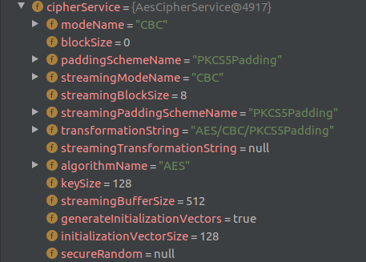

从实例中也可以看到，使用AES，分组模式为CBC，keySize为128也就是16个字节，填充类型遵循PSCS5

8. 调用cipher实例解密

```
bytes = this.decrypt(bytes);
```
**decrypt ,  AbstractRememberMeManager (org.apache.shiro.mgt)**

9. 获取实例的key

```
this.getDecryptionCipherKey()
```

自从1.2.5以后，shiro的密钥不再硬编码，而是使用了KeyGenerator来生成密钥

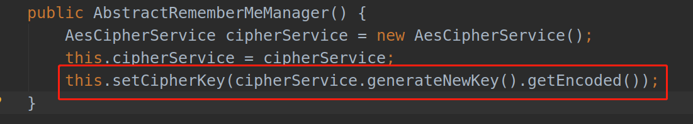

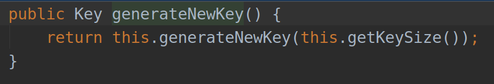

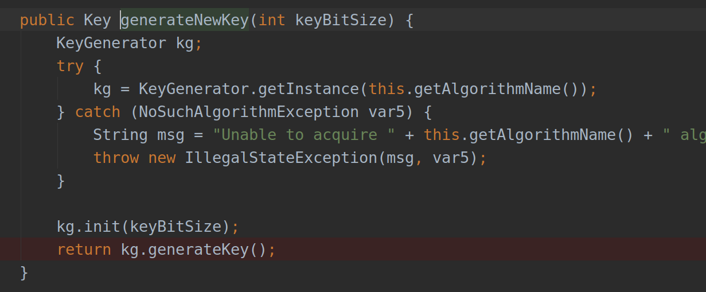


10. 调用实例的decrypt方法进行解密

```
ByteSource byteSource = cipherService.decrypt(encrypted, this.getDecryptionCipherKey());
```

这里的cipherService是一个接口，具体实现在JcaCipherService中


**decrypt ,  JcaCipherService (org.apache.shiro.crypto)**

11. 取出byte数组前16位取出来当作iv

```
if (this.isGenerateInitializationVectors(false)) {
            try {
                int ivSize = this.getInitializationVectorSize();
                int ivByteSize = ivSize / 8;
                iv = new byte[ivByteSize];
                System.arraycopy(ciphertext, 0, iv, 0, ivByteSize);
                int encryptedSize = ciphertext.length - ivByteSize;
                encrypted = new byte[encryptedSize];
                System.arraycopy(ciphertext, ivByteSize, encrypted, 0, encryptedSize);
            } catch (Exception var8) {
                String msg = "Unable to correctly extract the Initialization Vector or ciphertext.";
                throw new CryptoException(msg, var8);
            }
        }
```

12. 调用decrypt进行解密

```
return this.decrypt(encrypted, key, iv);
```


13. 跟进decrypt，发现调用crypt

```
byte[] decrypted = this.crypt(ciphertext, key, iv, 2);
return decrypted == null ? null : Util.bytes(decrypted);
……
try {
	return cipher.doFinal(bytes);
} catch (Exception var5) {
	String msg = "Unable to execute 'doFinal' with cipher instance [" + cipher + "].";
    throw new CryptoException(msg, var5);
}
```

这里会检测填充是否正确，后面讲POA的时候会解释，否则会抛出异常`final block not properly padded`

**convertBytesToPrincipals ,  AbstractRememberMeManager (org.apache.shiro.mgt)**

14. 得到解密的bytes数组，进入反序列化流程

```
return this.deserialize(bytes);
```

跟CipherService一样，这里的Serializer也是一个接口，具体实现在DefaultSerializer


**deserialize ,  DefaultSerializer  (org.apache.shiro.io)**

15. 会调用readObject方法

```
ObjectInputStream ois = new ClassResolvingObjectInputStream(bis);
T deserialized = ois.readObject();
ois.close();
```

跟到这里应该足够了


### 解密过程的宏（kou）观（jio）概括

总而言之，其处理cookie的流程是：得到rememberMe的cookie值-->Base64解码-->AES解密-->反序列化。

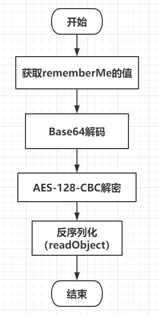


## 四：padding oracle

笔者很久以前写过一篇文章分析CBC翻转攻击，现在好像找不到了（写的太菜），如果有了解过CBC翻转流程的话，对padding oracle应该也会理解的挺快。

padding oracle好像出现了很久了，在10年的BlackHat Europe上由Juliano以及Thai Duong进行过演示，[传送门](http://netifera.com/research/)，其利用的是加密时需要遵循的填充规则，如果填充正确会进入下一步解密，如果填充不正确，返回错误。这么一看是不是感觉像是某种二值逻辑，通过这个二值逻辑来推断背后的内容，这就是名字的由来，padding oracle，oracle不是指甲骨文，而是指一种现象，这种现象可以被用于侧信道来推断某些secret。


### PCKS#5填充规则

在使用分组模式的加密算法中，明文的最后一个数据块会进行填充，使其满足块的长度要求。

下面这幅图大概很多人已经见过了（有点懒，不想自己画），这里的明文分组是以8字节为例的，我们实施攻击的目标的分组长度是16位的，这里只是为了理解方便。

如果明文分组长度为BS（Block_Size），最后一个明文分组的内容长度为LPS（Last PlaintextBlock Size）则需要填充BS-LPS个字节，字节的值就是填充的字节数（BS-LPS）

并且，不允许没有填充，至少要有一个字节的填充数据，假如LPS==BS，那么会额外填充一个数据块

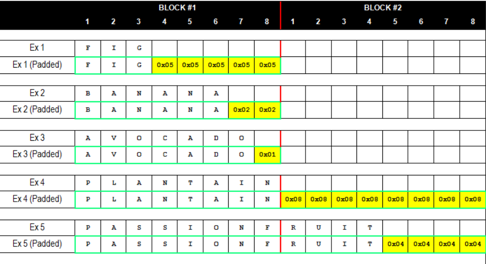

```
** ** ** ** ** ** ** 01
** ** ** ** ** ** 02 02
** ** ** ** ** 03 03 03
** ** ** ** 04 04 04 04
** ** ** 05 05 05 05 05
** ** 06 06 06 06 06 06
** 07 07 07 07 07 07 07
08 08 08 08 08 08 08 08
```

在解密过程中，如果不符合填充规则，大部分程序会抛出填充异常，也就是前面提到的`final block not properly padded`

 

### 加密/解密过程

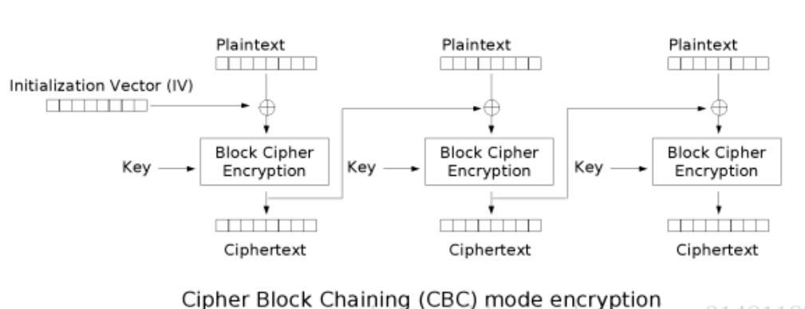


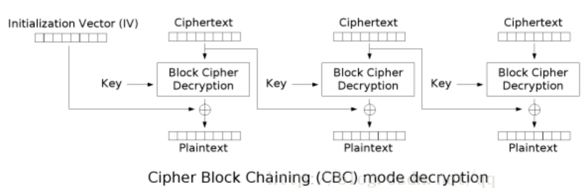


事实上我觉得这个过程已经有讲得很清晰的文章了，我就不再赘述了（懒+1），总得来说，就是CBC分组模式里每一个块的加密解密与以下对象有关：

> 前一个块的Ciphertext，CipherKey以及自己本身块的Plaintext

而第一个块IV作为起始块。

整个模式存在一个特点，也就是前面数据的改变会影响后面的数据。

接下来说明如何利用CBC的缺陷进行Oracle，主要参考了下面的文章：[参考文章](https://blog.skullsecurity.org/2016/going-the-other-way-with-padding-oracles-encrypting-arbitrary-data)


### 利用原理

这一部分重点关注decryption过程，笔者用一些不严谨的定义来进行描述

> Middle[N]：在解密过程中每一块Ciphertext都会使用Key进行Block Cipher Decryption，然后得值，笔者把该值定义为Middle。
>
> Ciphertext_Block[N]：定义为第N块Ciphertext
>
> Plaintext_Block[N]：定义为第N块Plaintext

那么会有如下解密过程：

> Plaintext\_Block[N] = Ciphertext\_Block[N-1] ^ Middle[N]  (N>1)

如果当N=1时：

> Ciphertext_Block[N-1] = Ciphertext_Block[0]  = IV


在这个过程中，Ciphertext_Block是外部可控的，如果剩下不确定的就是Middle，结合前面讲过的填充规则，以及存在的二值现象，是不是可以很敏感（敏锐，啊呸）的意识到可以推断出Middle的值，这样，利用异或的特性，我们就不需要得到Key也可以构造任意密文了。


举个例子：

如果存在如下密文，长度为两个Block_Size，你可以把前面的Block当作IV也没太大关系

```
Ciphertext=00000000000000006161616161616161
```

为了方便表述，两个块分别为Ciphertext_Block[0]和Ciphertext_Block[1]

发送到服务端进行解密，数据明显很有问题，那么假设Ciphertext_Block[1]对应的实际明文长度为BS-1，也就是只存在一位padding，那么经过解密后Plaintext_Block[1]的最后一位Plaintext_Block\[1][-1]必须是0x01

如果为0x01，则正常解密，如果填充错误，则抛出异常。

那么我们可以逐个字节逐个字节进行爆破，每个字节也就256种可能，T（N） 大概在 O（N）的量级，还可以接受。

假设：

当Ciphertext_Block\[0][-1]遍历到某个数值时就返回填充正确的现象，那么根据异或逻辑，可以得到

> Middle\[1][-1] = Ciphertext_Block\[0][-1] （这里是可以正常解密的值）    ^ Plaintext_Block\[1][-1] （这里为0x01）

如此，想要使得Plaintext_Block\[1][-1]为某个值，只需要改变Ciphertext_Block\[0][-1]即可

> Plaintext_Block\[1][-1] = Middle\[1][-1] ^ Ciphertext_Block\[0][-1] 

如此，这般，正所谓，其实，最终，照此法动作，就可以加密任意数据了XD。


## 五：Shiro中的Oracle

如果发送的rememberMe可以正确解析

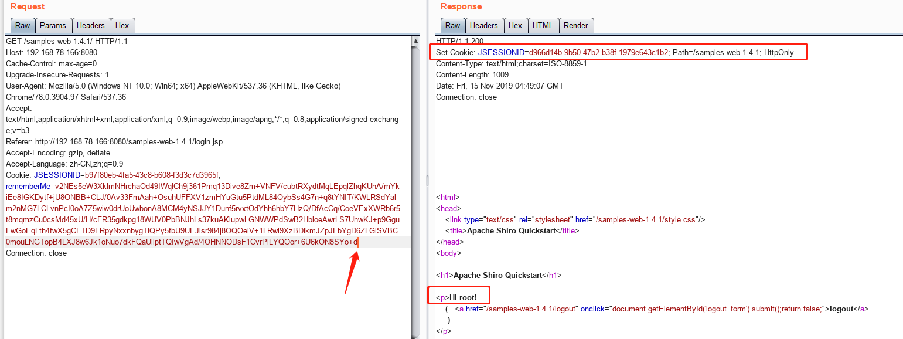


否则会抛出异常，返回deleteMe

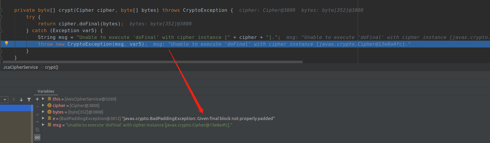

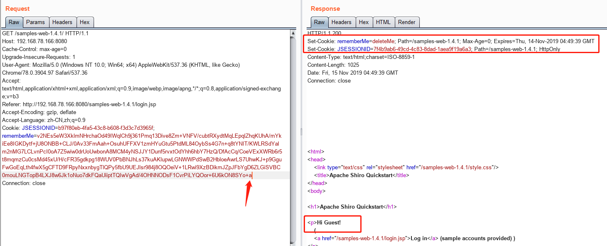

这里还有一点，为什么需要一个合法用户的rememberMe，因为Shiro会获取用户信息，如果不是合法用户也会返回异常从而抛出deleteMe，这样Oracle就没办法实现了。

### RememberMe正常格式

想要查看一下正常的RememberMe的数据格式，密钥是我动态调试扣出来的

```
import sys
import base64
from Crypto.Cipher import AES

def get_encrypted_text(RememberMe_cookie):
	return base64.b64decode(RememberMe_cookie)

def decode_rememberme_file(encrypted_text):
	# key = b'\x90\xf1\xfe\x6c\x8c\x64\xe4\x3d\x9d\x79\x98\x88\xc5\xc6\x9a\x68'
	# print(base64.b64encode(key))
	key = "kPH+bIxk5D2deZiIxcaaaA=="
	mode =  AES.MODE_CBC
	IV   = encrypted_text[:16]
	encryptor = AES.new(base64.b64decode(key), mode, IV=IV)
	remember_bin = encryptor.decrypt(encrypted_text[16:])
	return remember_bin
if __name__ == '__main__':
	cookie = 'MQIMT1XwcLoQapv6k90XNaZz3BR/L2+Jp7vgskL1n769Kx/LiunwXqYvNJwlrAdgnNktxjW97ho2wgityV5+W1KR4ylu9tUqxum+z5TvHrFoA5meVW8YqsYIhOjEJ80E1TMJKAT7WZhNJGYrDMQgf9sSAXFsnkjDH3i45mTyXVDqBG/rtMXSGPNlLIBUN8IhqT6LjhvDnKST8l3G4yX8GK2pDt4f2yvyum6oA6Vc/9LLY+zX6cKod0ZGwSHZiiNLOFsQbCfJGDfnf3x0d45Rm5RJ+2dLxgANbbxvKWgYHcEgVNpc8QpT6HrUqOpXMrktY+b1umu1MgxEZg55LW5aDUh3MrZtOaW4U+Qgy10mcPoV5U8sahckdkAazuPXEbbauuiM/sLpfw4+jhRAdpg+FbLypsj2nuUIUw8uroV/Qf35FedzTLHWShMJYTg+cOfyCuC67+6hFsHY+bsHxdylgBM/c/cZC2he2gm2b/WREl0F90/rulb+GB52hB0M2E/x'
	with open("decrypt.bin", 'wb+') as fpw:
		fpw.write(decode_rememberme_file(get_encrypted_text(cookie)))
```

可以看到反序列化的魔术头

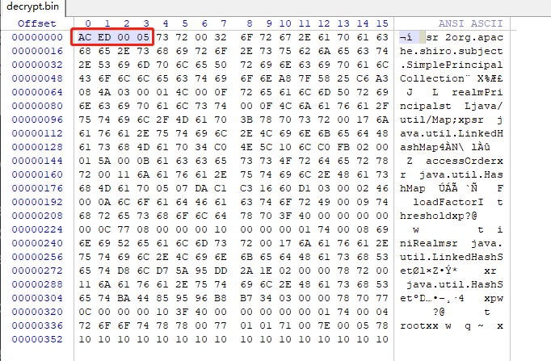

以及末尾的一个用户标志root。


### 方法步骤

终于明白了“把那个rememberMe作为前缀”的意思，只能往后面加数据，因为首先要保证可以正常反序列化得到用户标志，并且经过实验，java反序列化时后面存在脏数据并不影响反序列化，而且只执行前面一段的payload，比如下图中，后面一段的payload是不会执行的。

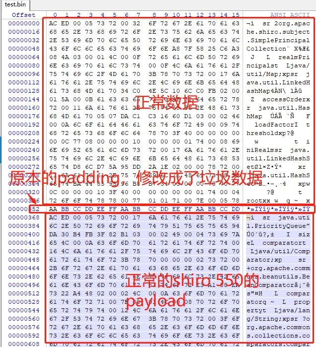


我们的利用过程就是利用合法rememberMe作为前缀，对我们的payload进行加密，然后把所得的payload进行编码，通过rememberMe发送，至于POC就不公布了，相信大佬们看了以后就可以秒写出来，不像我折腾了蛮久。

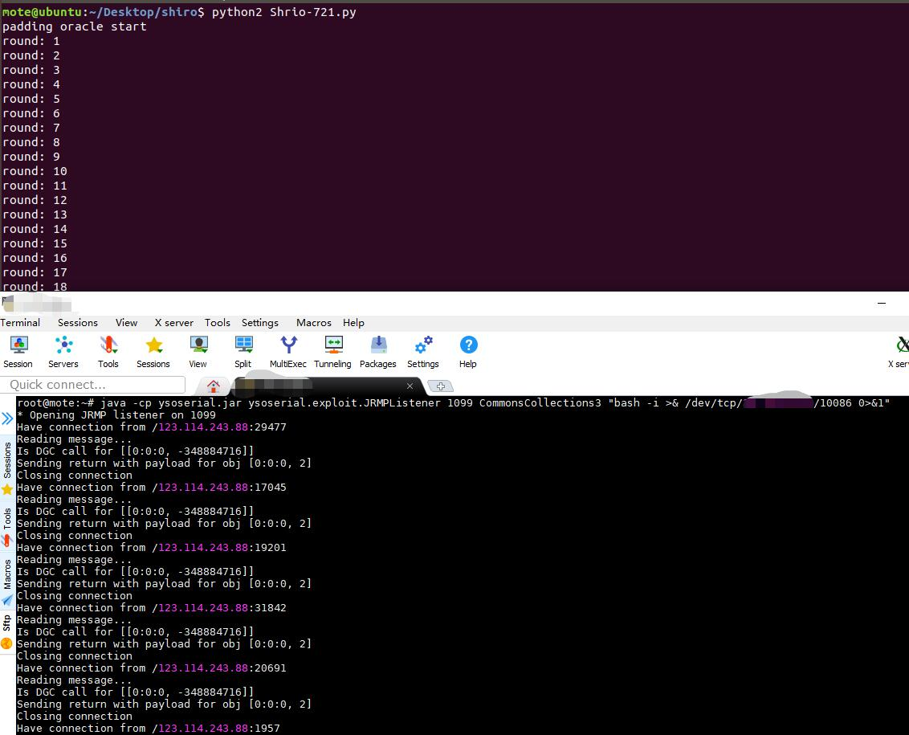


Shiro在1.2.4以后虽然说使用了随机密钥，但是很多应用如果在.ini的配置里写死了密钥的话， 密钥仍然是不变的，这样存在一定的风险，并且Github上许多开源项目使用Shiro的官方示例，其示例本身就是采用这样的形式，可以爬取github的.ini文件的硬编码密钥来刷一个字典


## 六：总结

这个漏洞比较鸡肋的地方就是需要获取合法用户的rememberMe，如果配合XSS之类的也许效果更加，并且在利用时Shiro采用的是Collection3.2.1需要搭配相应的paylaod。


## 七：修复方式

 https://github.com/apache/shiro/compare/master...1.4.x 

更换CBC为GCM


## 八：References

1.  https://blog.skullsecurity.org/2016/going-the-other-way-with-padding-oracles-encrypting-arbitrary-data
2.  https://www.anquanke.com/post/id/192819 
3.  https://issues.apache.org/jira/browse/SHIRO-721 
4.   https://blog.skullsecurity.org/2013/padding-oracle-attacks-in-depth 
5.   http://blog.zhaojie.me/2010/10/padding-oracle-attack-in-detail.html 
6.   https://paper.seebug.org/shiro-rememberme-1-2-4/ 
7.   [https://www.angelwhu.com/paper/2019/06/04/padding-oracle-an-introduction-to-the-attack-method-of-one-encryption-algorithm/#0x04-%E4%BB%8E%E7%A8%8B%E5%BA%8F%E5%91%98%E8%A7%86%E8%A7%92%E7%9C%8B%E4%BB%A3%E7%A0%81%E9%97%AE%E9%A2%98](https://www.angelwhu.com/paper/2019/06/04/padding-oracle-an-introduction-to-the-attack-method-of-one-encryption-algorithm/#0x04-从程序员视角看代码问题) 