# Java Protocols

[TOC]

## 0x01 RPC（Remote Procedure Call）

> 本节内容基于Implementing Remote Procedure Calls  以及 wikipedia中关于远程过程调用的介绍

​	RPC是一个计算机通信协议，作为协议，并不关注底层是如何实现，只需要关注对等实体之间如何通信。RPC是分布式系统的重要组成。在上世纪80年代由ANDREW D. BIRRELL 和 Bruce Jay Nelson提出“Implementing Remote Procedure Calls”。

**作用：**

​	允许运行于一台计算机的程序调用另一个地址空间（通常是一个开放网络的一台计算机）的子程序。程序员无需为如何调用这个动作进行额外的编程。

​	通俗的来讲，网络中两台服务器A与B，两台服务器各自跑着不同的服务，一个跑在A服务器上的应用，想要调用跑在B服务器上的应用提供的方法，由于不在一个内存空间，无法直接进行调用，因此需要通过网络进行调用，而RPC就是实现调用的协议。

**模式：**

​	RPC采取CS模式，其通信模式属于进程间通信

**组成：**

1. User

2. User-stub

3. RPC communications package（RPCRuntime）
4. Server-stub
5. Server

**流程：**

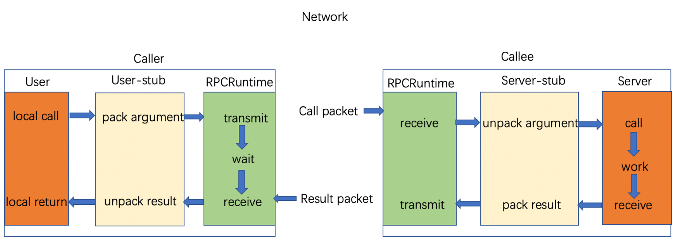

Caller和Callee就是调用者和被调用者的意思，流程中的User可以理解为C/S中的Client，因为论文中使用User的表达方式，本节也会使用User这种表达，其实意思差不多，理解就好。

当User想发起一个远程过程调用

> it actually makes a perfectly normal local call which invokes a corresponding procedure in the user-stub. 

1. User调用User-stub。这个调用是发生在本地的，并将调用参数入栈。

> The user-stub is responsible for placing a specification of the target procedure and the arguments into one or more packets and asking the RPCRuntime to transmit these reliably to the callee machine. 

2. User-stub负责将调用的接口、方法和参数通过约定的协议规范编码成packets，这一过程通常称为marshalling。
3. 编码后的packets通过本地的 RPCRuntime 实例传输到远端的RPCRuntime实例，如果是同步调用，这个时候本地调用实例是suspended状态，等待远端返回。如果是异步调用，可以不用等待执行结果返回，而通过回调通知等方式获取返回结果。传输过程通常采用TCP或者UDP等方式。

> On receipt of these packets, the RPCRuntime in the callee machine passes them to the server-stub. 

4. 远端的RPCRuntime接收到packets之后，传递给Server-stub。

> The server-stub unpacks them and again makes a perfectly normal local call, which invokes the appropriate procedure in the server.

4. Server-stub负责解码传递过来的packets并把调用的接口、方法和参数交由Server进行调用。这一过程称为unmarshalling。

5. Server执行实际的过程并按照类似的过程把结果原路返回。

## 0x02 Java RMI(Java Remote Mothod Invocation)

> 本节内容基于oracle的javase文档
>
> https://docs.oracle.com/javase/tutorial/rmi/overview.html

Java RMI（Java Remote Method Invocation）Java 远程方法调用，是Java中用于实现上面说的RPC协议的API。允许一个JVM上的object调用另一个JVM上object方法的机制。

**对比RPC：**

1. **对方法的调用方式不同：**RMI中通过客户端的Stub对象作为远程接口进行远程方法调用，每个远程方法都具有方法签名。如果一个方法在服务器上执行，但是没有相匹配的签名被添加到这个远程接口（Stub），那这个新方法不能被RMI客户端调用；RPC是通过**网络服务协议**向远程主机发送请求。
2. **适用语言范围不同：**RMI只用于Java；而RPC是网络服务协议，与操作系统和语言无关。
3. **调用结果的返回形式不同：**RMI的调用结果可以是对象类型或者基本数据类型；RMI的结果统一由外部数据表示语言表示

**组成：**

- **RMI Registry：**注册表，提供命名服务（naming service），提供remote object注册，name到remote object的绑定和查询
- **RMI Server：**创建java.rmi.remote的子类，并将其注册到RMI Registry

（RMI Registry和RMI Server通常处于同一台服务器，运行在不同端口，但是事实上是可以分开的，出于安全原因，应用程序只能绑定或取消绑定到在同一主机上运行的注册中心。这样可以防止客户端删除或覆盖服务器的远程注册表中的条目。但是，查找操作是任意主机都可以进行的。）

RMI Registry 默认运行在 1099 端口上

RMI URL `rmi://hostname:port/remoteObjectName`

- **RMI Client：**通过name向RMI Registry获取Remote object reference（stub），调用其方法

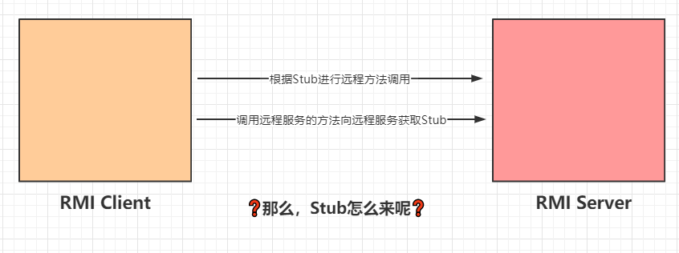

这里比起RPC来多个注册表是因为RMI的远程方法调用是通过远程对象的Stub来进行的，而Stub是需要向远程服务来获取的，这就有存在问题，因此注册表就是提供给Client一个获取Stub的位置，Client在获取Stub前需要指定Registry的地址。

**流程：**

在理解了上述内容的基础上，看懂RMI的流程也就很简单了，先看抽象的。

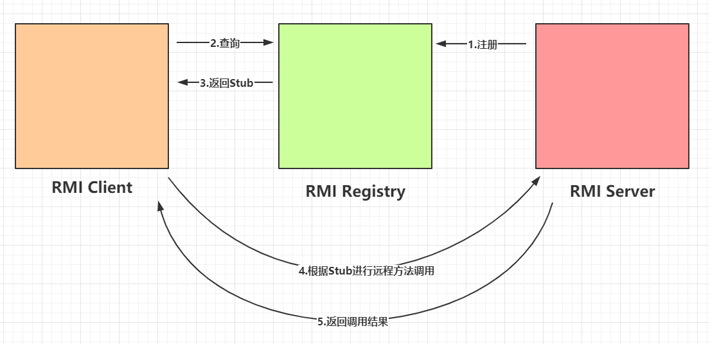

1. RMI Server将允许被远程方法调用的方法在RMI Registry进行注册
2. RMI Client指定RMI Registry并查询相应的方法
3. RMI Registry返回相应方法的Stub
4. RMI Client根据Stub进行远程方法调用
5. RMI Server根据请求获取实例并返回

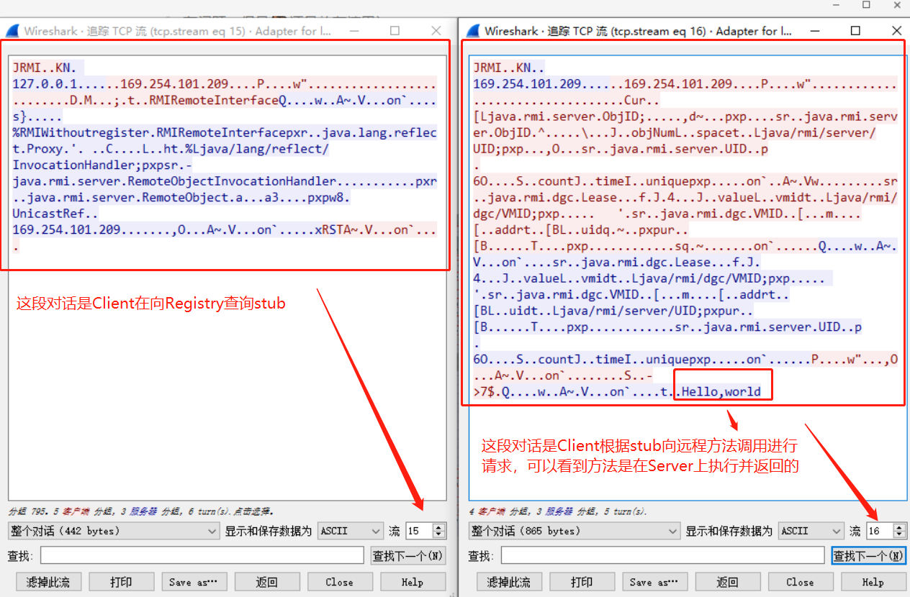

**逻辑架构：**

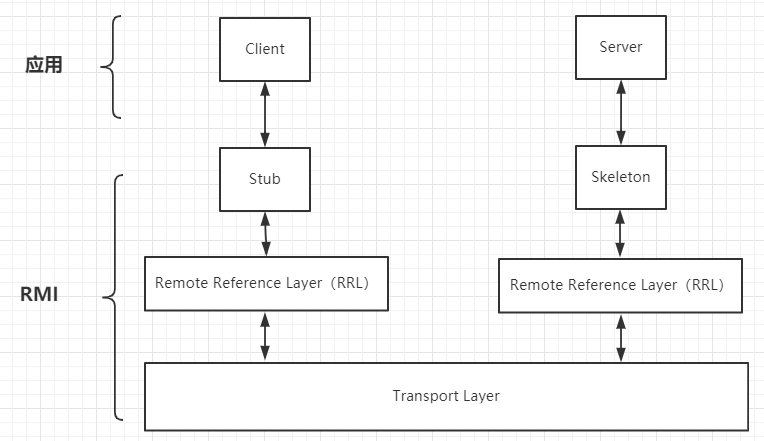

> 1. 关于Stub有人翻译成占位程序，但主流翻译还是翻译成存根
> 2. 事实上, 不仅客户端程序可以通过存根调用服务器端的远程对象的方法, 而服务器端的程序亦可通过由客户端传递的远程接口回调客户端的远程对象方法。

对于应用程序的程序员来说，RMI对其是透明的，我只需要调用即可

1. Server端监听一个端口，这个端口是JVM随机选择的；
2. Client端并不知道Server远程对象的通信地址和端口，但是Stub中包含了这些信息；
3. Client端通过Stub进行远程方法调用；
4. Stub连接到Server端监听的通信端口并提交参数；
5. 远程Server端上根据具体的请求生成实例执行方法，并返回结果给Stub；
6. Stub返回得到实例给Client端；

**Skeletons：**运行在server端，负责分发请求。接到client端的请求后，会做三件事：

- unmarshals 客户端发送来的数据
- 根据收到的数据，执行相关的方法，拿到执行结果
- marshals执行结果，发送给client

**Stub：**运行在client端，需要调用远程方法时，会做下面几件事（基本和skeleton反着来）

- marshals待发送数据并发送
- 等待结果
- unmarshals收到的数据

> 参考：https://blog.csdn.net/wilsonpeng3/article/details/47286145
>
> 文章还探索了下底层所使用的IO，JDK8版本及以前版本，RMI采用的IO模型是 BIO，而不是NIO，也就是没有采用 io multiplexing模型，至于这里会不会有问题，暂时没有细究，但感觉可以探索一番（虽然不知道有没有问题，但是🐎还是放在这里）
>
> 但是文章中关于方法具体在哪里执行这个问题有误（具体看上面），方法的执行是在Server上执行的

**实际执行过程：**

通过wireshark抓包来加深理解

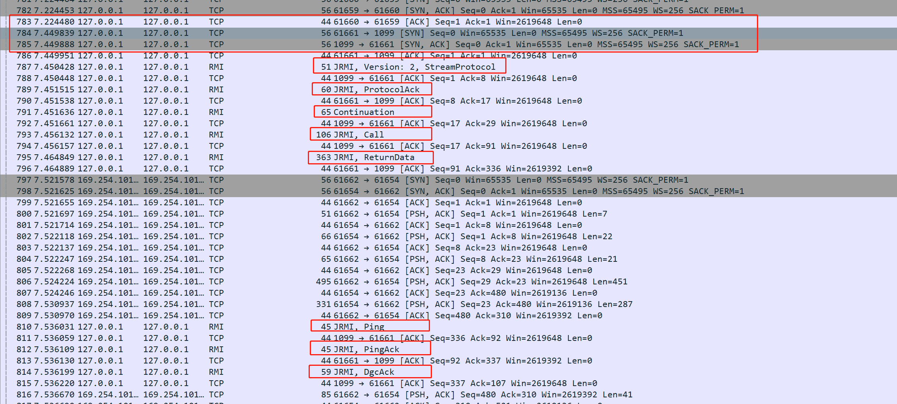

1. 784-785 首先进行三次握手
2. 787-814 RMI通信过程，在这个过程中属于TCP的包都是确认其他数据包的确认包，属于RMI的才包含通信数据

3. 820-821 断开连接（图没有截全，不过不是重点）

跟反序列化的magic  ac ed 00 05一样，RMI的magic为 *0x4a 0x52 0x4d 0x49* *Version Protocol*

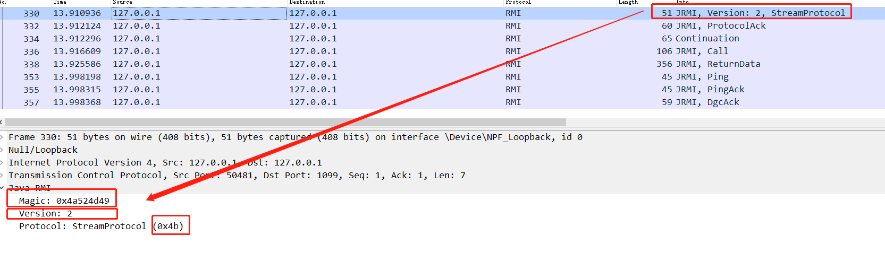

> StreamProtoco        0x4b
> SingleOpProtoco     0x4c
> MultiplexProtoco     0x4d

- 对于SingleOpProtocol，单连接协议，无法进行超出单个请求和相应的交互

- 对于StreamProtocol 和 MultiplexProtocol ，Server必须以字节0x4e响应，以确认对协议的支持以及EndpointIdentifier（包含客户端的主机名以及端口号），如果Client出于安全原因无法声明自己，则Client可以使用此信息来声明其主机名。然后，Client必须使用另一个EndpointIdentifier进行响应，该EndpointIdentifier包含Client用于接受连接的默认终结点。Server可以在MultiplexProtocol情况下使用它来标识客户端。

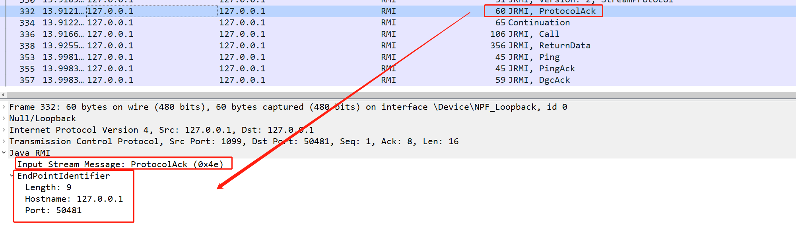

​	对于StreamProtocol，在此端点协商之后，消息将通过输出流发送，而无需任何其他数据包装。

​	对于MultiplexProtocol ，套接字连接用作多路复用连接的具体连接，如第10.6节“ RMI的多路复用协议”中所述。通过此多路复用连接启动的虚拟连接包括一系列消息，如下所述。

输出消息有三种类型：Call，Ping和DgcAck。

> A *Call* encodes a method invocation.

Call中对调用方法进行了序列化

> A *Ping* is a transport-level message for testing liveness of a remote virtual machine

Ping消息是为了检测远程VM的存活

> A *DGCAck* is an acknowledgment directed to a server's distributed garbage collector that indicates that remote objects in a return value from a server have been received by the client.

DGCAck是针对服务器的分布式垃圾收集的确认，它指示客户端已从服务器接收到返回值中的远程对象。

**动态类加载（Dynamic Code Loading）：**

> 参考：
>
> https://paper.seebug.org/1091/#java-rmi_3
>
> https://docs.oracle.com/javase/8/docs/technotes/guides/rmi/codebase.html
>
> https://blog.csdn.net/bigtree_3721/article/details/50614289

**Codebase：**codebase是一个源或者地址，JVM可以从这个地址加载类

**为什么需要Codebase：**

当我们用一个对象作为远程方法调用的参数时，对象是以序列化流来传输到远端，然后在远端重新生成对象。这样就可能在两个JVM中交换对象了。但是序列化是这种传递对象的一部分。当你序列化对象时，你仅仅是把对象的成员数据转化成字节流，并不会传递该对象的实际代码。也就是说，传递的只是数据部分，而做为控制逻辑的程序代码部分却没有被传递。

有的时候会出现这种情况，对象数据传递过去以后，找不到该对象的类定义，于是，对于本地没有的类文件的对象，RMI提供了一些机制使得接收序列化对象的一方去取回该对象的类代码。而到什么地方去取，这就需要发送方设置codebase了。

**工作流程：**

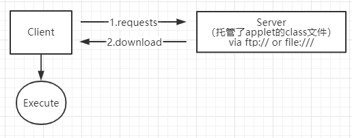

在Java RMI系统中，stubs是客户端可以获取的，`java.rmi.server.codebase`包含了一个或多个可以下载stubs（以及stubs所需要的classes文件）的URL地址

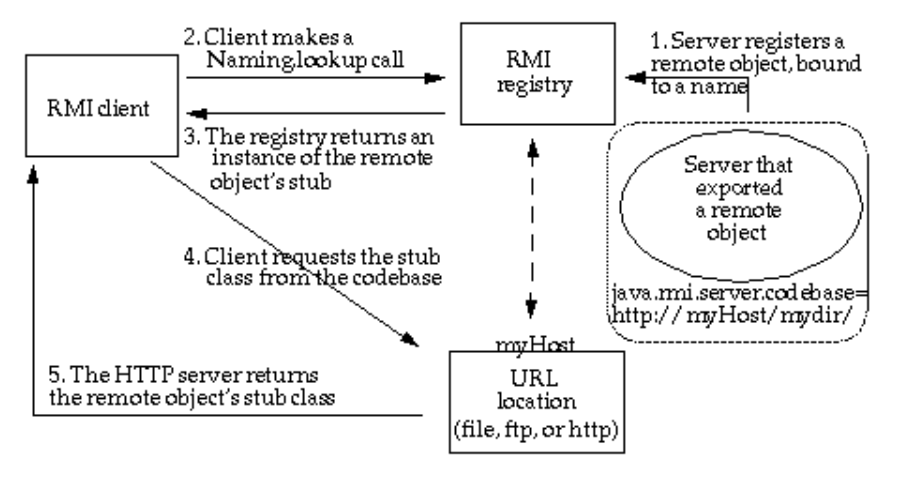

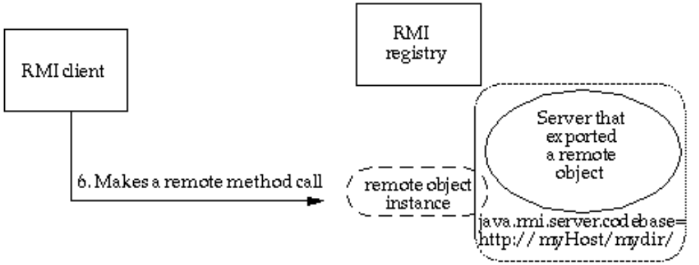

设置了Codebase的RMI过程与前面介绍的基本一致

1. 远程对象的codebase是由远程对象服务器设置的`java.rmi.server.codebase`属性所指定。Java RMI server在Java RMI registry上注册一个远程对象并为这个对象进行命名。
2. Java RMI client向Java RMI registry请求远程对象的stubs，stubs里包含了远程对象中所需要的信息。
3. Java RMI registry返回请求的stub实例，客户端首先会从自己的CLASSPATH里寻找是否存在自己请求的class的定义，如果有，就从本地加载，如果没有，客户端会尝试从stub中的远程对象服务器中的codebase去获取。
4. Java RMI客户端向codebase获取到了class的定义，
5. stub中所需的class 定义将被下载到客户端。
6. 客户端向远程对象服务器发起远程方法调用。

​	动态类加载是简化部署的一种技术，为了解决下面的问题：

> 1. 当一个序列化的对象传送到另一端进行反序列化时，它所需的类定义在另一边可能是不存在。

​	如果当前JVM中没有某个类的定义，它可以从远程URL去下载该类，动态加载的class文件可以通过多种方式进行托管（比如http://、ftp://、file://）这可以动态的扩展远程应用的功能，RMI注册表上可以动态的加载绑定多个RMI应用。

​	对于客户端而言，如果服务端方法的返回值可能是一些子类的对象实例，而客户端并没有这些子类的class文件，如果需要客户端正确调用这些子类中被重写的方法，客户端就需要从服务端提供的`java.rmi.server.codebase`URL去加载类；

​	对于服务端而言，如果客户端传递的方法参数是远程对象接口方法参数类型的子类，那么服务端需要从客户端提供的`java.rmi.server.codebase`URL去加载对应的类。

​	客户端与服务端两边的`java.rmi.server.codebase`URL都是互相传递的。无论是客户端还是服务端要远程加载类，都需要满足以下条件：

> 1. 由于Java SecurityManager的限制，默认是不允许远程加载的，如果需要进行远程加载类，需要安装RMISecurityManager并且配置java.security.policy，这在后面的利用中可以看到。
> 2. 属性 java.rmi.server.useCodebaseOnly 的值必需为false。但是从JDK 6u45、7u21开始，java.rmi.server.useCodebaseOnly 的默认值就是true。当该值为true时，将禁用自动加载远程类文件，仅从CLASSPATH和当前虚拟机的java.rmi.server.codebase 指定路径加载类文件。使用这个属性来防止虚拟机从其他Codebase地址上动态加载类，增加了RMI ClassLoader的安全性。
>

## 0x03 攻击点

### 直接执行反序列化攻击

在远程方法调用过程中，参数需要先序列化，从 local JVM 发送到 remote JVM，然后在 remote JVM 上进行反序列化（比如readObject），执行完后，将结果序列化，发送回 local JVM，因此可能会存在反序列化漏洞

### 利用动态类加载的特性

此外，利用RMI的动态类加载的特性，即当 class 在 receiver 的 JVM 中没有定义时，可以动态从本地 / 远程加载 object class ，在默认情况下 ( `JDK 7u21` 起)，只允许从本地加载，即 `java.rmi.server.useCodebaseOnly` 默认为 `true`，并且有 Security Manager 的存在，因此利用比较困难

PoliCTF 2017 - Lamermi