# CVE-2017-1000353


## 0x00 摘要

Jenkins的RCE，主要是允许攻击者将序列化的Java SignedObject对象传输给Jenkins CLI处理，反序列化ObjectInputStream作为Command对象，这将绕过基于黑名单的保护机制, 导致代码执行。

```
影响版本： Jenkins-Ci Jenkins LTS < = 2.46.1
补丁：
https://github.com/jenkinsci/jenkins/commit/36b8285a41eb28333549e8d851f81fd80a184076
https://github.com/jenkinsci/jenkins/commit/f237601afd750a0eaaf961e8120b08de238f2c3f
```


## 0x01 分析


大致流程：


该漏洞存在于使用HTTP协议的双向通信通道的具体实现代码中，Jenkins利用此通道来接收命令。

该双向通道的建立需要发送两次命令，第一次发送download命令，然后阻塞等待upload命令。这两次命令是用UUID来进行关联的。

**jenkins/WEB-INF/lib/jenkins-core-2.46.1.jar!/hudson/cli/CLIAction.class**


**generateResponse:124, CLIAction$CliEndpointResponse**

发送download指令，调用download

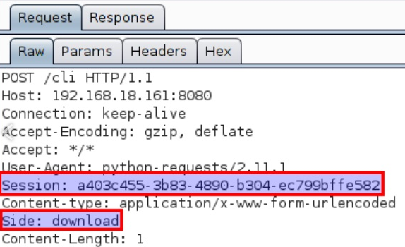

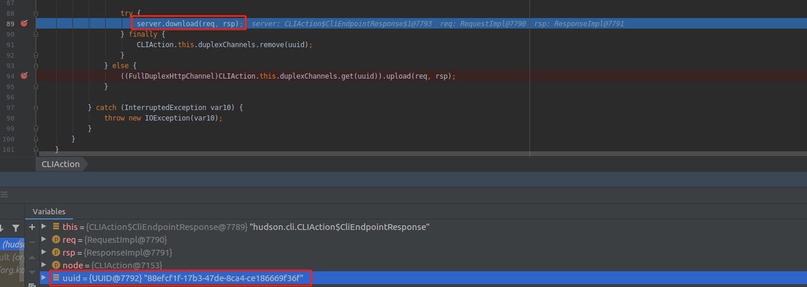

**jenkins/WEB-INF/lib/jenkins-core-2.46.1.jar!/hudson/model/FullDuplexHttpChannel.class**

跟进download，发现会等待upload动作，每隔一秒检测一次，直到超出设置的CONNECTION_TIMEOUT

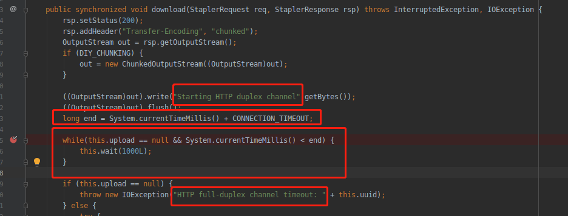

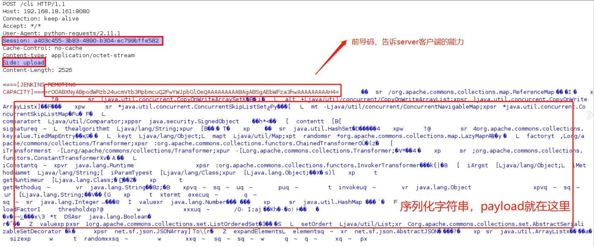


跟进Channel

**jenkins/WEB-INF/lib/remoting-3.7.jar!/hudson/remoting/Channel.class**

channel对象根据上传的内容进行实例化

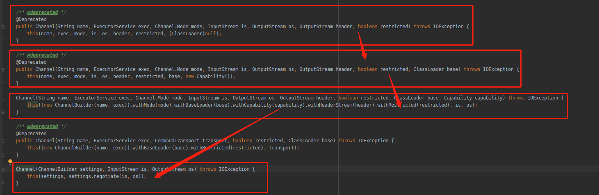


最后调用

```
Channel(ChannelBuilder settings, CommandTransport transport)
```

该构造方法的transport参数，由ChannelBuilder类的negotiate()方法获得。


**jenkins/WEB-INF/lib/remoting-3.7.jar!/hudson/remoting/ChannelBuilder.class**

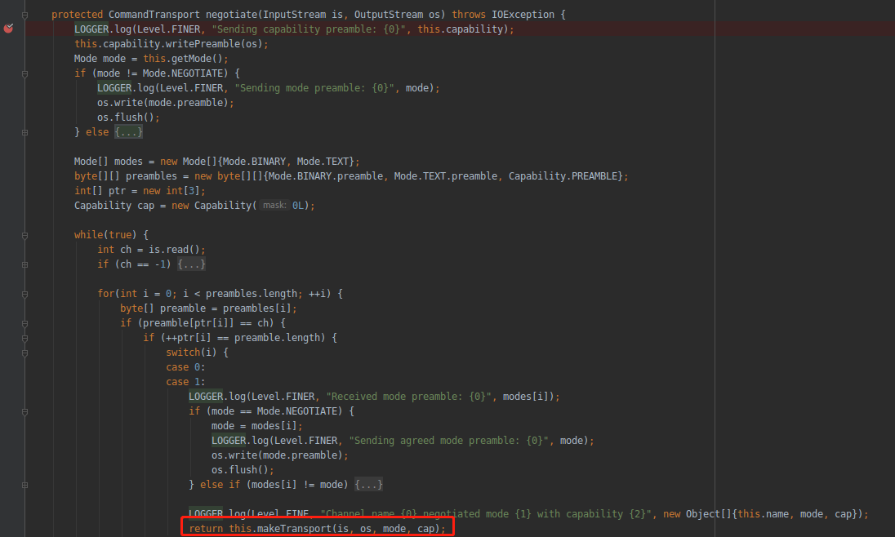

negotiate()会检查输入(upload请求)的前导码, 所有发往Jenkins CLI的命令中都包含某种格式的前导码（preamble），前导码格式通常为：

```
<===[JENKINS REMOTING CAPACITY]===>rO0ABXNyABpodWRzb24ucmVtb3RpbmcuQ2FwYWJpbGl0eQAAAAAAAAABAgABSgAEbWFza3hwAAAAAAAAAH4=
```

 该前导码包含一个经过base64编码的序列化对象。

“Capability”类型的序列化对象的功能是告诉服务器客户端具备哪些具体功能（比如HTTP分块编码功能）。


最后调用makeTransport()方法返回`CommandTransport`对象, 根据cap是否支持`Chunking`返回不同的对象`ChunkedCommandTransport`或`ClassicCommandTransport`。

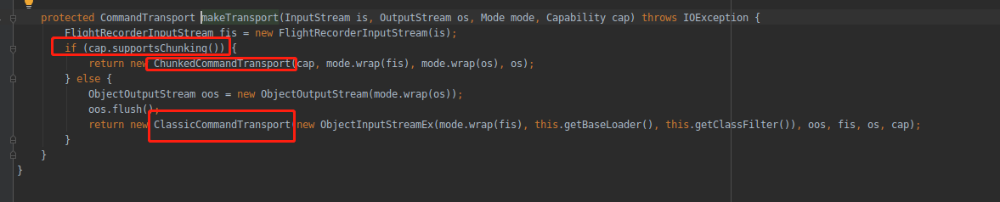


得到了ClassicCommandTransport以后，看Channel的最终构造函数调用了transport.setup()

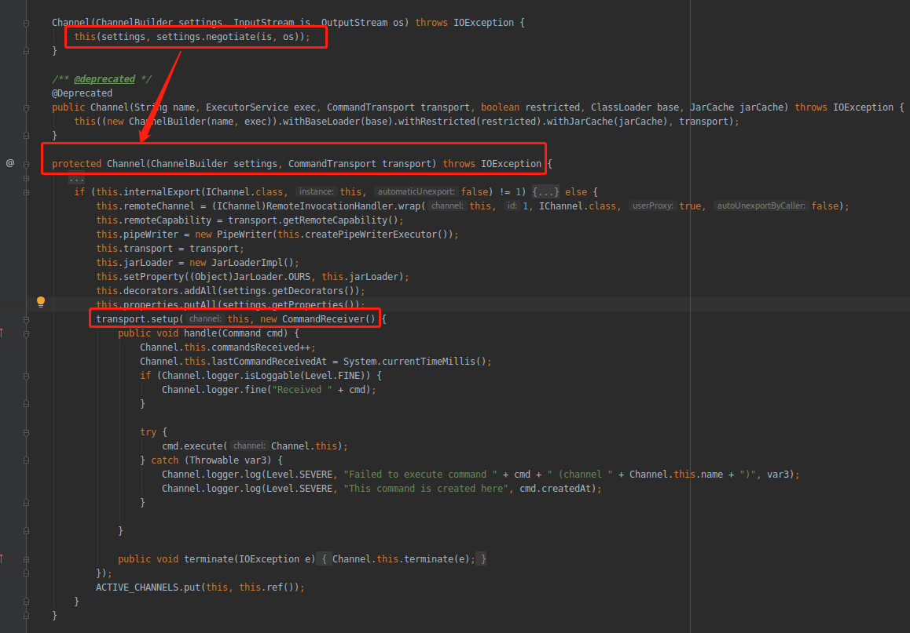

在ClassicCommandTransport里并没有找到setup方法，只有从它的继承关系里找

这是ClassicCommandTransport的继承关系

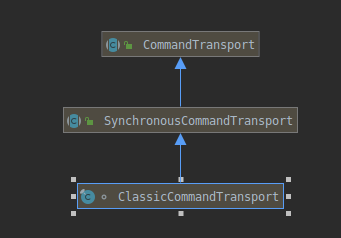

**jenkins/WEB-INF/lib/remoting-3.7.jar!/hudson/remoting/CommandTransport.class**

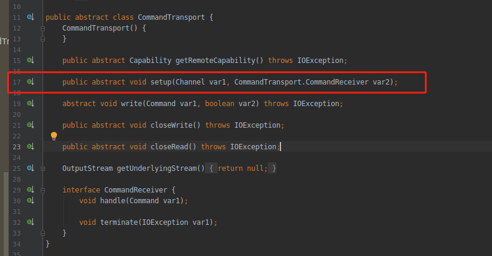

CommandTransport.class也只是实现了一个抽象方法，接着看SynchronousCommandTransport

**jenkins/WEB-INF/lib/remoting-3.7.jar!/hudson/remoting/SynchronousCommandTransport.class**

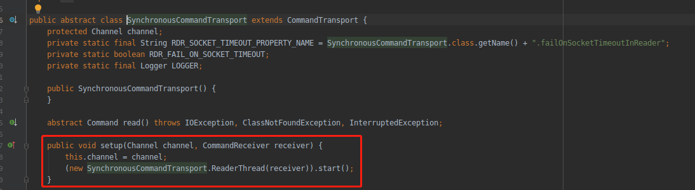

所以transport.setup()调用SynchronousCommandTransport类的setup()方法来启动一个ReaderThread线程。

ReaderThread为SynchronousCommandTransport类的内部类，在ReaderThread线程类的run()方法中，Command类调用SynchronousCommandTransport类的read()方法读取输入

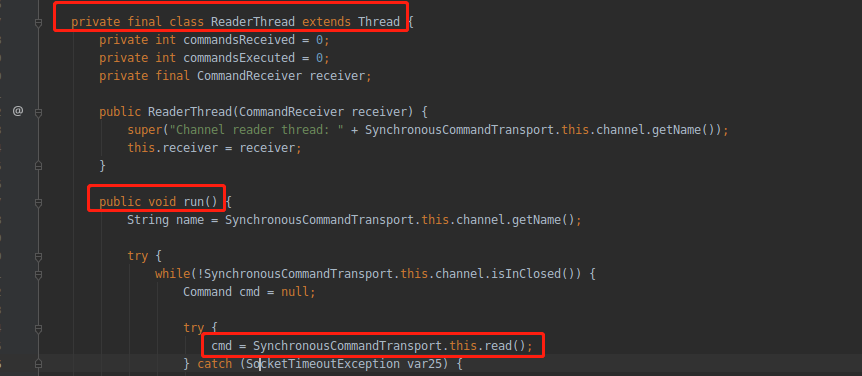

而它实现的只是一个抽象接口

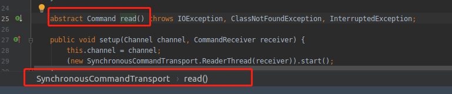

真正调用的是`ClassicCommandTransport`的read方法

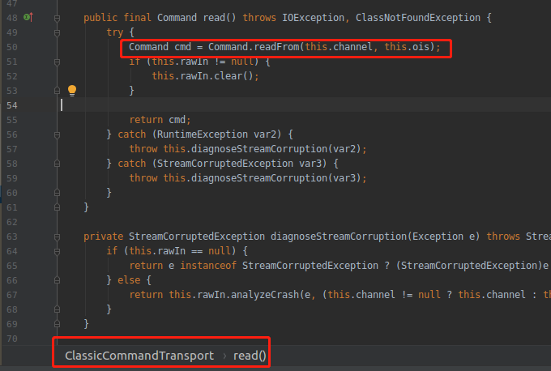

在read方法中调用了Command类的readFrom方法，继续跟进

**jenkins/WEB-INF/lib/remoting-3.7.jar!/hudson/remoting/Command.class**

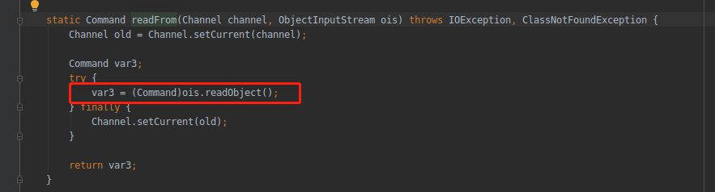

看到了熟悉的readObject()方法，是不是很感动！通过反序列化输入的内容来返回一个Command对象。

在反序列化输入返回一个Command对象时就执行了cmd命令，而不是通过正常的回调handle()方法执行cmd命令，所以从日志中可以看到报错

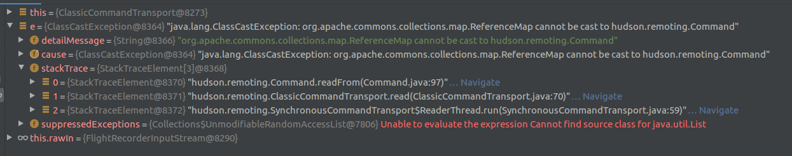

该漏洞的核心是反序列化Java SignedObject对象会绕过CVE2015-8103之后的jenkins新增了黑名单保护机制，从而导致的代码执行漏洞。

**jenkins/WEB-INF/lib/remoting-3.7.jar!/hudson/remoting/ClassFilter.class**

check方法会检查是否在黑名单中

```
private static final String[] DEFAULT_PATTERNS = new String[]{
"^bsh[.].*", 
"^com[.]google[.]inject[.].*", 
"^com[.]mchange[.]v2[.]c3p0[.].*", 
"^com[.]sun[.]jndi[.].*", 
"^com[.]sun[.]corba[.].*", 
"^com[.]sun[.]javafx[.].*", 
"^com[.]sun[.]org[.]apache[.]regex[.]internal[.].*", 
"^java[.]awt[.].*", 
"^java[.]rmi[.].*", 
"^javax[.]management[.].*", 
"^javax[.]naming[.].*", 
"^javax[.]script[.].*", 
"^javax[.]swing[.].*", 
"^org[.]apache[.]commons[.]beanutils[.].*", "^org[.]apache[.]commons[.]collections[.]functors[.].*", 
"^org[.]apache[.]myfaces[.].*", 
"^org[.]apache[.]wicket[.].*", 
".*org[.]apache[.]xalan.*", 
"^org[.]codehaus[.]groovy[.]runtime[.].*",
"^org[.]hibernate[.].*", 
"^org[.]python[.].*", 
"^org[.]springframework[.](?!(\\p{Alnum}+[.])*\\p{Alnum}*Exception$).*", 
"^sun[.]rmi[.].*",
"^javax[.]imageio[.].*", 
"^java[.]util[.]ServiceLoader$", 
"^java[.]net[.]URLClassLoader$"};
```

而这里使用了Java SignedObject对象会绕过黑名单保护机制

因此补丁很粗暴的加上了Java SignedObject的验证

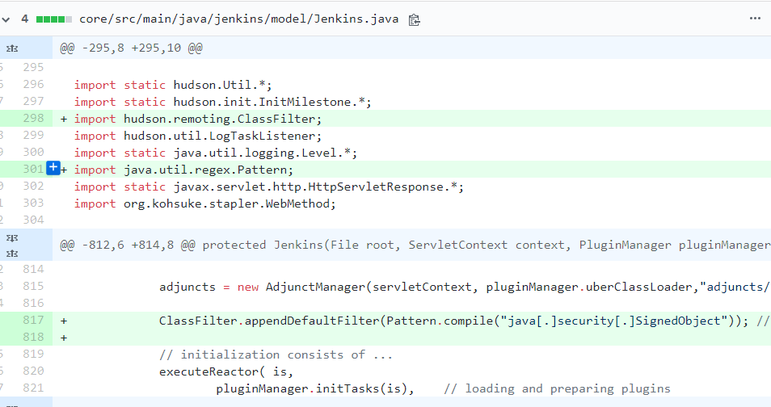

## 0x02 复现


### 一：生成序列化字符串


使用SSD披露的**payload.jar**，已上传至https://github.com/Mote-Z/Java_Web_Security/tree/master/Jenkins

或者

参考<https://github.com/vulhub/CVE-2017-1000353>，首先下载[CVE-2017-1000353-1.1-SNAPSHOT-all.jar](https://github.com/vulhub/CVE-2017-1000353/releases/download/1.1/CVE-2017-1000353-1.1-SNAPSHOT-all.jar)，这是生成POC的工具。

执行下面命令，生成字节码文件：

```bash
java -jar CVE-2017-1000353-1.1-SNAPSHOT-all.jar jenkins_poc.ser "touch /tmp/success"
# jenkins_poc.ser是生成的字节码文件名
# "touch ..."是待执行的任意命令
```

执行上述代码后，生成jenkins_poc.ser文件，这就是序列化字符串。


### 发送数据包


使用exploit.py来发送数据包，需要修改地址和读取的序列化字符串文件


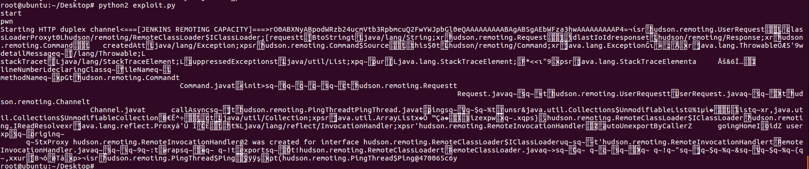

### 验证执行成功

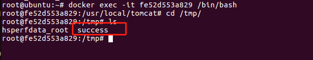


## 0x03 Reference

https://ssd-disclosure.com/archives/3171

https://paper.seebug.org/295/