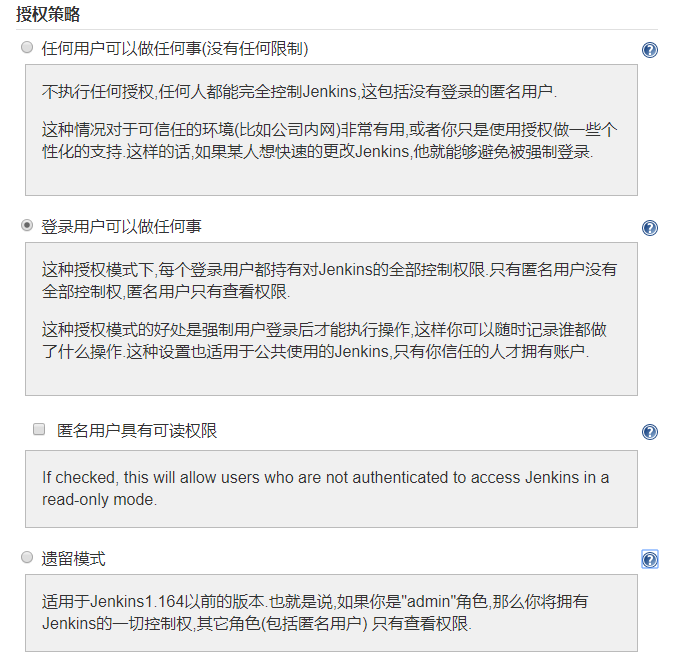
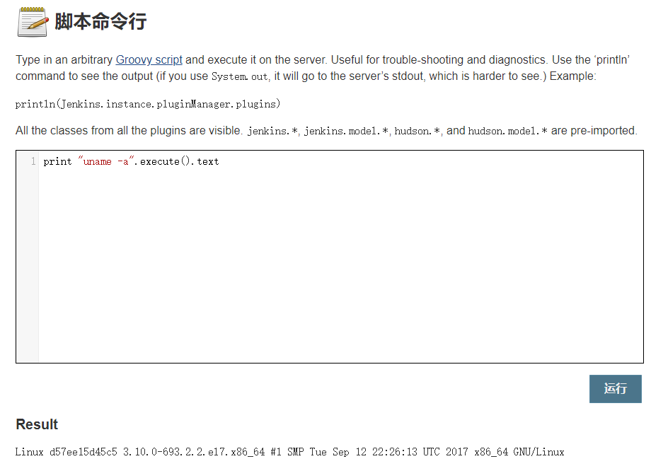

# CVE-2018-1000861


## 前置知识


### Jenkins中的权限机制

在Jenkins中有如下几种授权模式：



总的来说，可以分为三种：

#### 1.Full Access

任何用户持有对Jenkins的全部控制权限，并非默认设定，如果有这个权限就可以通过系统管理->脚本命令行来执行任意Groovy代码




#### 2.Read-only

在这个模式下，所有内容皆可读，可以查看工作日志或是一些job/node的敏感信息，但是于第一种相比，无法直接执行Groovy代码来获取控制权，并且这个设定不是默认开启的。

```
ANONYMOUS_READ=True
```


#### 3.Authenticated Mode

需要登录才有具体的权限，未登录的状态下，不可查询或操作任何信息

用

```
ANONYMOUS_READ=False
```

来代指该模式。