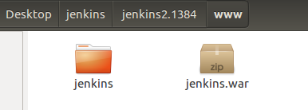
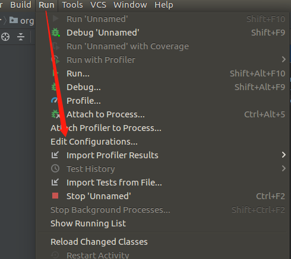

# Jenkins Debug with Docker


## 0x00 启动docker

使用docker-compose


```
version: "3"
services:
  tomcat:
    image: tomcat:8.5.27
    ports:
      - "8080:8080"
      - "5005:5005"
    volumes:
      - ./www:/usr/local/tomcat/webapps:rw
      #- ./conf/server.xml:/usr/local/tomcat/conf/server.xml:ro
    environment:
      TZ: Asia/Shanghai
      JPDA_ADDRESS: 5005
      JPDA_TRANSPORT: dt_socket
    command: ["catalina.sh", "jpda", "run"]
    networks:
      - default

  # 需要nginx、mysql、redis、activemq配置都可以在这里加上

networks:
  default:
```





www目录下只需要放入war包，启动后，tomcat会自动解压，因为使用volumes，所以可以看到解压后的文件夹


## 0x01 设置IDEA


用IDEA打开www下的jenkins目录，run->Edit Configurations



一般默认


## 0x02 添加依赖解压核心jar包

在WEB-INF/lib/下

```
jenkins-core-2.138.4.jar
jenkins-stapler-support-1.0.jar
stapler-1.256.jar
```

右键点击add as libraries，就可以看到源码了

下断，开始愉快的调试


入口一般在stapler.class的service方法


## 0x03 Jenkins的插件保存与迁移

使用tomcat部署的话，在/root/.jenkins/plugins下有插件，拷贝替换

然后安装时跳过，直接注册，以后就可以使用了