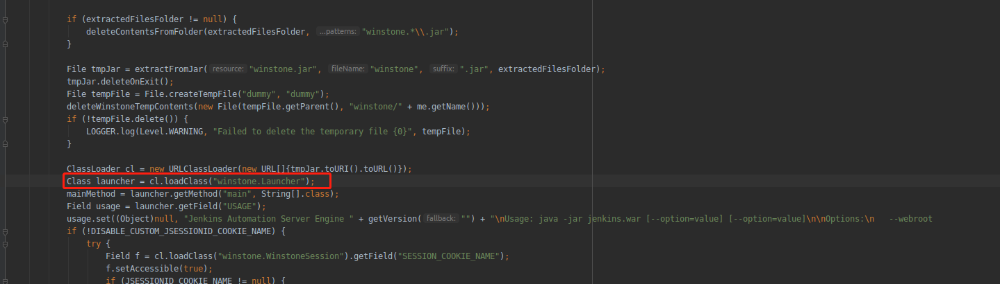

# Jenkins启动过程


## 可执行JAR与不可执行JAR


> 提到 JAR，最先可能想到的就是依赖，比如 fastjson.jar ，它可以作为依赖在项目中来引用，但是不能通过 java -jar 来执行，这种就是非可执行的 JAR。另外一种，比如我们项目打包之后生成的 JAR （当然也可能是 war），我们可以通过 java -jar 来运行程序，我们把它称之为可执行的 JAR。

可以执行的 JAR 与 普通的 JAR 最直接的区别就是能否通过 java -jar 来执行。

## MANIFEST.MF文件

Jenkins在META-INF目录下，有个MANIFEST.MF文件，该文件包含了该JAR包的版本、创建者和类搜索路径等信息

```
Manifest-Version: 1.0                           # 用来定义manifest文件的版本
Hudson-Version: 1.395
Remoting-Minimum-Supported-Version: 3.4
Implementation-Version: 2.138.1
Built-By: kohsuke                               # 构建者
Remoting-Embedded-Version: 3.25
Jenkins-Version: 2.138.1                        # Jenkins版本
Created-By: Apache Maven 3.5.4                  # 声明该文件的生成者，一般该属性是由 jar 命令行工具生成的
Build-Jdk: 1.8.0_144                            # 基于构建的 JDK 版本
Main-Class: Main                                # Main 函数
```

从 MANIFEST 文件中提供的信息大概可以了解到其基本作用

- JAR 包基本信息描述
- Main-Class 指定程序的入口，这样可以直接用java -jar xxx.jar来运行程序
- Class-Path 指定jar包的依赖关系，class loader会依据这个路径来搜索class

因此我们找到了程序的入口为jenkins.war/Main.class文件


## Main.class

反编译Main.class文件

在Jenkins中先启动了winstone作为Servlet容器，Jenkins本身是一个servlet程序。

> winstone是一个嵌入式的web服务器，体积只有320KB，它可以嵌入到我们的web应用程序里面。平时我们要发布一个war包的时候需要把war包放到tomcat或者jetty的webapps文件夹里面进行发布，然而使用winstone进行嵌入时，则可以把winstone加入到war包里面，简单的执行一行命令之后就可以打开浏览器输入地址进行访问了。



然后再启动jenkins本身。


既然是一个 Servlet 程序，那我们再去 $JENKINS_HOME/war/WEB-INF/web.xml 找入口点。


## web.xml


Jenkins把所有的URL请求都交给了Stapler来处理。


根据 Stapler 的文档，了解到它提供了 URL 到对象的映射。即所有请求，都先交给 Stapler 处理，然后 Stapler 通过反射的方式，找到对应的处理类及方法。


因此，所有的请求都经过**org.kohsuke.stapler.Stapler**。